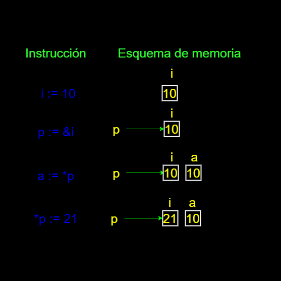

# GolangPractice
Repositorio para guardar avances de aprendizaje y documentación sobre el lenguaje GO
[Sitio oficial][golang-oficial-site]

# Historia y caracteristicas principales

Golang, es un lenguaje de programación desarrollado por Google. Fue anunciado en noviembre de 2009 y lanzado públicamente en marzo de 2012. El equipo de desarrollo de Go incluyó a Robert Griesemer, Rob Pike y Ken Thompson, todos con una sólida experiencia en el campo de la programación.

Entre sus principales caracteristicas tenemos:
- Es **versatil** ya que combina caracteristicas de lenguajes de bajo nivel como **C++** puede ser usado para creación de software de sistema, como por ejemplo, controladores, comandos de SO, agentes etc.
- Es **rápido** ya que sus ejecutables se distribuyen en codigo nativo sin necesidad de maquinas virtuales como Java o interpretes como python. Go se enfoca en la eficiencia en términos de consumo de memoria y rendimiento. Es particularmente adecuado para aplicaciones de alto rendimiento y sistemas distribuidos.
- Es **compacto** Genera ejecutables pequeños sin necesidad de bibliotecas externas o entornos de ejecución.
- Es **muy rápido compilando** Está enfocado en **CI/CD**  po lo cual está enfocado en la productividad.
- Es **seguro** Go tiene un recolector de basura eficiente que gestiona automáticamente la memoria, lo que facilita la escritura de código sin preocuparse demasiado por la gestión de la memoria.
- Es **sencillo** Facil de leer y de entender para disminuir el tiempo en revisión entre los equipos de desarrollo.
- **Concurrencia Nativa** Go tiene soporte integrado para la concurrencia y la programación concurrente. Los goroutines (hilos ligeros) y los canales son parte integral del lenguaje y facilitan la escritura de programas concurrentes.
- Es **completo** la distribución estandar provee casi todas las herramientas necesarias para crear cualquier funcionalidad.
- **Garantía de Estructura de Código** Go proporciona herramientas como gofmt para formatear automáticamente el código de manera consistente, lo que ayuda a mantener una estructura de código uniforme en proyectos grandes.
- Es **Open Source** todo el codigo asi como sus librerias son de codigo abierto.

# Comandos Básicos

- **go run**: Este comando se utiliza para compilar y ejecutar programas Go.
- **go build**: Compila el programa y genera un ejecutable. Puedes ejecutar el programa compilado por separado.
- **go install**: Instala el paquete o programa en el directorio bin de tu espacio de trabajo.
- **go get**: Descarga e instala paquetes o bibliotecas de otros repositorios.
- **go fmt**: Formatea el código fuente de acuerdo con las convenciones de formato de Go. Ayuda a mantener un estilo de código consistente.
- **go vet**: Examina el código en busca de errores comunes. Ayuda a encontrar problemas en el código que podrían no ser evidentes.
- **go test**: Ejecuta pruebas en el código. Go tiene un enfoque integrado para las pruebas unitarias, y este comando ejecutará los tests en el código.
- **go mod**: Gestiona módulos Go. Los módulos son una forma de gestionar dependencias en proyectos Go. Algunos subcomandos de go mod incluyen **init, tidy, vendor**, entre otros.
- **go doc**: Muestra la documentación para el paquete o símbolo especificado.

# Primer programa con GO

Crea un archivo que se llame hola.go y itroduce el siguiente contenido.
```go
package main

import "fmt"

// Función principal "main"
func main() {
	// Muestra un saludo en pantalla
	fmt.Println("Hola mundo desde go")
}
```

De este codigo podemos ver que el punto de arranque del programa es el codigo contenido en la función main().<br>
Cada fichero está encabezado por una directiva package que otroga un nombre comun para el paquete, el punto de inicio de un programa debe estar encabezado por el package main.<br>
Se pueden incorporar funcionalidades desde otras librerias con la directiva import.<br>
Para ejecutar el programa, desde la shell se introduce lo siguiente
```bash
go run hola.go
```
Esto permite ejecutar el programa, para crear un ejecutable se debe usar el comando
```bash
go build hola.go
```
Esto creara un ejecutable para la misma arquitectura desde la cual se realiza el compilado, para realizar compilados para otras arquitecturas se puede utilizar variables de entorno **GOOS** y **GOOARCH**
```bash
GOOS=windows GOARCH=386 go build hola.go
GOOS=linux GOARCH=arm64 go build hola.go
```
Los ateriores comandos generarian ejecutables para windows x86 y para linux arm64 respectivamente.

# Sintaxis básica de GO

Go es un lenguaje de timado estatico por lo cual cada variable solo podrá guardar valores de su mismo tipo; go provee los siguientes tipos de datos básicos:

## **Enteros**
    - **int**: Tipo de datos para enteros con signo (puede ser int8, int16, int32, int64).
    - **uint**: Tipo de datos para enteros sin signo (puede ser uint8, uint16, uint32, uint64).
    - **uintptr**: Tipo para almacenar valores sin signo de tamaño suficiente para contener los bits no interpretados del valor de un puntero.
## **Punto flotante**
    - **float32** Tipo de datos para números de punto flotante de 32 bits.
    - **float64** Tipo de datos para números de punto flotante de 64 bits.
## **Complejos**
    - **complex64**: Tipo de datos para números complejos con partes reales e imaginarias de 32 bits.
    - **complex128**: Tipo de datos para números complejos con partes reales e imaginarias de 64 bits.
## **Booleano**
    - **bool**: Tipo de datos que representa valores booleanos (true o false).
## **Cadena de texto:** 
Go permite definir una variable de cadena de texto ingresando cualquier dato ente " tambien soporta caracteres de escape para el uso de funcionalidades dentro del texto.<br>
En Go, los caracteres de escape (\) en las cadenas de texto (variables de tipo string) se utilizan para representar caracteres especiales o secuencias de escape. Estos caracteres permiten incluir caracteres que de otra manera serían difíciles de representar directamente en una cadena o que tienen un significado especial en el contexto de las cadenas de texto. Aquí hay algunos ejemplos de caracteres de escape comunes en Go

- \n - Salto de línea
- \t - Tabulación
- \r - Retorno de carro
- \b - Retroceso

Tambien es posible usar indicador de acento grave(\`) para realizar saltos de linea y demas por ejemplo:
```go
texto:= `- Esta es una linea
- esta es otra linea y todo está en la misma variable`
```
    - **string**: Tipo de datos para representar cadenas de texto.
## **Carácter:**
    - **byte** (uint8): Tipo de datos para representar un solo byte (sinónimo de uint8).
    - **rune** (int32): Tipo de datos para representar un solo carácter Unicode (sinónimo de int32).
## **Puntero:**
    - **\*T**: Tipo de datos de puntero, donde T es el tipo apuntado.
## **Estructuras y Tipos Compuestos:**
    - **struct**: Tipo de datos que permite agrupar diferentes tipos de datos bajo una estructura.
    - **array**: Tipo de datos para representar arreglos de longitud fija.
    - **slice**: Tipo de datos para representar slices, que son segmentos flexibles de arreglos.
    - **map**: Tipo de datos para representar mapas o diccionarios.
## **Interfaces:**
    - **interface**: Tipo de datos que define un conjunto de métodos que un tipo debe implementar para satisfacer la interfaz.
## **Funciones:**
    - **func**: Tipo de datos que representa funciones.
## **Canal:**
    - **chan**: Tipo de datos para representar canales, utilizados para la comunicación entre goroutines.


Go permite definir una variable de cadena de texto ingresando cualquier dato ente " tambien soporta caracteres de escape para el uso de funcionalidades dentro del texto.<br>
En Go, los caracteres de escape (\) en las cadenas de texto (variables de tipo string) se utilizan para representar caracteres especiales o secuencias de escape. Estos caracteres permiten incluir caracteres que de otra manera serían difíciles de representar directamente en una cadena o que tienen un significado especial en el contexto de las cadenas de texto. Aquí hay algunos ejemplos de caracteres de escape comunes en Go

- \n - Salto de línea
- \t - Tabulación
- \r - Retorno de carro
- \b - Retroceso

Tambien es posible usar indicador de acento grave(\`) para realizar saltos de linea y demas por ejemplo:
```go
texto:= `- Esta es una linea
- esta es otra linea y todo está en la misma variable`
```

## Definición de variables
La manera de definir una variable en go especificando el tipo de dato y el valor es `var <nombre> <tipo> [ = <valor>]`
```go
var dias int
var edad int = 12
```
Sino se provee un valor inicial las variables se iniciaran automaticamente con el valor cero para cada tipo de dato ej:
- int = 0
- bool = false
- string = ""
Para facilitar se puede omitir la palabra var y el tipo con el operador de inicialización(:=)
```go
meses := 12
```
cAl usar el operador de inicialización el compilador de Go inferirá el tipo de la variable, el operador de inicialización solo puede ser usado como su nombre lo indica para inicializar la variable, si esta cambia en algun momento se debe usar el de asignación (=)

## conversión explicita de tipos

En Go, la conversión explícita de tipos se realiza cuando deseas convertir un valor de un tipo a otro de manera explícita mediante el uso de operadores de conversión. Esto se utiliza cuando los tipos de datos son diferentes y deseas convertir un valor de un tipo a otro compatible.
La sintaxis básica para la conversión de tipo explicita en Go es: 
```go
nuevoTipo(expresion)
```
Donde nuevoTipo es el tipo al que deseas convertir y expresion es el valor que deseas convertir.<br>
Un ejemplo completo es:
```go
package main

import "fmt"

func main() {
    // Conversión explícita de int a float64
    entero := 42
    flotante := float64(entero)
    fmt.Printf("Entero: %d, Flotante: %f\n", entero, flotante)

    // Conversión explícita de float64 a int
    otroFlotante := 3.14
    otroEntero := int(otroFlotante)
    fmt.Printf("Flotante: %f, Entero: %d\n", otroFlotante, otroEntero)

    // Conversión explícita de int a string
    numero := 123
    cadena := string(numero)
    fmt.Printf("Número: %d, Cadena: %s\n", numero, cadena)
}
```
En el primer ejemplo, convertimos un entero (entero) a un float64. En el segundo ejemplo, convertimos un float64 (otroFlotante) a un entero. Y en el tercer ejemplo, intentamos convertir un entero (numero) a una cadena (cadena).

Es importante mencionar que la conversión explícita solo tiene sentido entre tipos que sean compatibles entre sí. Por ejemplo, no puedes convertir directamente entre tipos incompatibles como int y string sin realizar una conversión más compleja.

Además, ten en cuenta que la conversión de tipos puede resultar en pérdida de información. Por ejemplo, al convertir de float64 a int, se truncarán los decimales y se perderá precisión. Por lo tanto, se debe realizar con precaución y considerar posibles pérdidas de datos.

## Constantes
Una constante es un valor que como su nombre lo indica será el mismo durante la ejecución del programa y no se puede cambiar, se define de la siguiente manera:
```go
const Pi = 3.1416
// 0
const Pi float64 = 3.1416
```
Al definir varias constantes se pueden agrupar semanticamente dentro de la misma directiva const:
```go
const (
    Font = "Times New Roman"
    Size = 12
    Bold = false
)
```
# Operadores numéricos


En Go, existen varios operadores numéricos que se utilizan para realizar operaciones matemáticas en valores numéricos. Aquí te presento una lista de los operadores numéricos más comunes en Go:
- Suma (+)
- Resta (-)
- Multiplicación (*)
- División (/)
- Módulo (%)
- Incremento (++)
- Decremento (--)
- Operadores de Asignación (+=, -=, *=, /=, %=):
    - Se utilizan para realizar una operación y asignar el resultado directamente a una variable.
```go
resultado := 10
resultado += 5  // Equivalente a resultado = resultado + 5
```
Estos son los operadores numéricos básicos en Go. Además de estos, Go también proporciona operadores bit a bit para manipulación de bits, pero esos son más avanzados y se utilizan en situaciones específicas.

El orden de precedencia en Go determina el orden en el que se evalúan las expresiones cuando hay múltiples operadores en una misma expresión. En Go, las expresiones se evalúan de izquierda a derecha siguiendo un orden específico de precedencia. Aquí está el orden de precedencia de los operadores en Go, de mayor a menor:
- ++, -- (postfijo)
- +, - (unario), !, ^ (bit a bit, complemento)
- *, /, %, <<, >>, & (bit a bit, AND), &^ (bit a bit, AND NOT)
- +, - (binario), | (bit a bit, OR), ^ (bit a bit, XOR)
- ==, !=, <, <=, >, >=
- <-
- &&
- ||
Esto significa que los operadores con mayor precedencia se evalúan primero. Por ejemplo, en la expresión `a + b * c`, la multiplicación **b * c** se evaluará antes de sumar el resultado **a**, debido a la mayor precedencia de * en comparación con +.

Es importante tener en cuenta que los paréntesis () pueden ser utilizados para alterar el orden de precedencia y forzar que ciertas partes de la expresión se evalúen antes que otras. Las expresiones dentro de paréntesis se evalúan primero.

# Operadores numericos de comparación 

Los operadores de comparación en Go permiten comparar expresiones numéricas y producir un resultado booleano (true o false). 
Los operadores de comparación en Go son:
- **Igualdad** (==): Comprueba si dos valores son iguales.
```go
resultado := (a == b)
```
- **Desigualdad** (!=): Comprueba si dos valores son diferentes.
```go
resultado := (a != b)
```
- **Menor que** (<): Comprueba si el valor de la izquierda es menor que el valor de la derecha.
```go
resultado := (a < b)
```
- **Menor o igual** que (<=): Comprueba si el valor de la izquierda es menor o igual al valor de la derecha.
```go
resultado := (a <= b)
```
- **Mayor que** (>): Comprueba si el valor de la izquierda es mayor que el valor de la derecha.
```go
resultado := (a > b)
```
- **Mayor o igual que** (>=): Comprueba si el valor de la izquierda es mayor o igual al valor de la derecha.
```go
resultado := (a >= b)
```
Estos operadores se utilizan comúnmente en estructuras de control de flujo condicional, como las declaraciones if, else if y switch. Aquí hay un ejemplo:

```go
package main

import "fmt"

func main() {
    a := 5
    b := 10

    if a == b {
        fmt.Println("a es igual a b")
    } else if a < b {
        fmt.Println("a es menor que b")
    } else {
        fmt.Println("a es mayor que b")
    }
}
```
En este ejemplo, se utilizan los operadores de comparación ==, < y > para determinar la relación entre las variables a y b y imprimir un mensaje correspondiente.

# Operadores de tipo String

En Go, los operadores de cadena (string) se utilizan para realizar operaciones específicas en cadenas de texto. Algunos de los operadores y operaciones más comunes que se puede realizar con cadenas en Go son:

- **Concatenación (+)**: Se utiliza para unir dos cadenas.
```go
cadena1 := "Hola"
cadena2 := " Mundo"
resultado := cadena1 + cadena2
```

En este ejemplo, resultado contendrá la cadena "Hola Mundo".

- **Comparación (==, !=, <, <=, >, >=)**: Los operadores de comparación se pueden utilizar para comparar cadenas lexicográficamente.
```go
cadena1 := "abc"
cadena2 := "def"

igual := (cadena1 == cadena2)
menorQue := (cadena1 < cadena2)
```
- **Longitud (len):** La función len se utiliza para obtener la longitud de una cadena, es decir, el número de bytes que contiene.
```go
cadena := "Hola"
longitud := len(cadena)  // longitud será 4
```

- **Acceso a caracteres:** Puedes acceder a un carácter específico de una cadena utilizando la notación de índice.
```go
cadena := "Hola"
primerCaracter := cadena[0]  // primerCaracter será 'H'
```
> Nota: En Go, las cadenas son secuencias inmutables de bytes, y cada carácter es un byte.

- **Slicing:** Puedes obtener subcadenas utilizando el slicing.
```go
cadena := "abcdefgh"
subcadena := cadena[1:5]  // subcadena será "bcde"
```
- **Conversiones entre string y []byte:** Puedes convertir una cadena a un slice de bytes ([]byte) y viceversa.
```go
cadena := "Hola"
bytes := []byte(cadena)
```
Esto es útil si necesitas modificar la cadena, ya que las cadenas son inmutables, pero los slices de bytes no lo son.
- **Funciones del paquete strings:** Go proporciona el paquete strings que incluye funciones para realizar diversas operaciones en cadenas, como Join, Split, Contains, Replace, etc.
```go
import "strings"

cadena := "Hola Mundo"
palabras := strings.Split(cadena, " ")
```

Estos son algunos de los operadores y funciones que puedes utilizar para trabajar con cadenas en Go entre otras

# Operadores booleanos

Cualquier variable o expresión que retorne un valor booleano pueder ser comparada con otro mediante operadores lógicos como los siguientes

|Operador   | Descripsión   | Ejemplo|
|:---------:|---------------|:-------:|
|**&&**         |Devuelve true si ambas expresiones son verdaderas, de lo contrario, devuelve false. |`resultado := expresion1 && expresion2`|
|**\|\|** |Devuelve true si al menos una de las expresiones es verdadera, de lo contrario, devuelve false |`resultado := expresion1 \|\| expresion2`|
|!|Niega la expresión booleana, convirtiendo true en false y viceversa.| `resultado := !expresion` |

# Operadores a nivel de BIT

Estos operadores a nivel de bit se utilizan para realizar manipulaciones en los bits individuales de los operandos. Son comúnmente utilizados en situaciones que involucran manipulación de datos a nivel de bits, como operaciones con máscaras, criptografía, y manipulación de datos en sistemas integrados.

|Operador   | Descripsión   | Ejemplo|
|:---------:|---------------|:-------:|
|**&**|Realiza una operación AND bit a bit entre dos operandos. |`0b_1010 & 0b_1100 == 0b_1000`|
|**\|**|Realiza una operación OR bit a bit entre dos operandos. |`0b_1010 \| 0b_1100 == 0b_1110`|
|**^**|Realiza una operación XOR bit a bit entre dos operandos.|`0b_1010 ^ 0b_1100 == 0b_0110`|
|**^**|NOT, cuando se aplica delante de un solo operador invierte el valor de cada digito|`^0b_100110 == 0b_011001`|
|**<<**|Desplaza los bits de la expresión de la izquierda hacia la izquierda por la cantidad especificada.|`0b_1001 << 2 == 0b_100100`|
|**>>**|Desplaza los bits de la expresión de la derecha hacia la derecha por la cantidad especificada.|`0b_1001 >> 2 == 0b_0010`|


# Salida estandar de datos

En Go, la salida estándar de datos se maneja mediante el paquete fmt. Este paquete proporciona funciones para formatear y imprimir datos en la salida estándar (normalmente la consola). Algunos de los aspectos básicos de cómo trabajar con la salida estándar en Go:

- **Función Print:** La función Print de fmt se utiliza para imprimir texto en la salida estándar.
```go
package main

import "fmt"

func main() {
    fmt.Print("Hola Mundo")
}
```
> En este ejemplo, "Hola Mundo" se imprimirá en la consola sin agregar un salto de línea al final.

- **Función Println:** La función Println imprime una línea de texto en la salida estándar, y agrega automáticamente un salto de línea al final.
```go
package main

import "fmt"

func main() {
    fmt.Println("Hola")
    fmt.Println("Mundo")
}
```

Esto producirá una salida como:
```txt
Hola
Mundo
```
- **Función Printf:** La función Printf se utiliza para imprimir texto formateado. Puedes incluir marcadores de posición en el texto y proporcionar valores para ser insertados.
```go
package main

import "fmt"

func main() {
    nombre := "Juan"
    edad := 30

    fmt.Printf("Nombre: %s, Edad: %d\n", nombre, edad)
}
```
Esto producirá una salida como:

```txt
Nombre: Juan, Edad: 30
```
Aquí, %s es un marcador de posición para una cadena, y %d es un marcador de posición para un entero.

- **Redirección de la Salida:** Puedes redirigir la salida a otros lugares que implementen la interfaz io.Writer, no solo a la consola. Por ejemplo, puedes redirigir la salida a un archivo.
```go
package main

import (
    "fmt"
    "os"
)

func main() {
    archivo, err := os.Create("salida.txt")
    if err != nil {
        fmt.Println("Error al crear el archivo:", err)
        return
    }
    defer archivo.Close()

    fmt.Fprintln(archivo, "Hola Mundo")
}
```

> En este ejemplo, la salida se redirige al archivo "salida.txt" en lugar de la consola.

Estas son algunas de las formas básicas de trabajar con la salida estándar en Go.

# Entrada de datos

En Go, la entrada de datos se puede realizar utilizando el paquete fmt para leer desde la entrada estándar o utilizando el paquete bufio para leer líneas completas. Algunos ejemplos básicos de cómo realizar la entrada de datos en Go:

- Usando **fmt.Scan** para leer valores desde la entrada estándar:

fmt.Scan se utiliza para leer valores desde la entrada estándar y asignarlos a variables.
```go
package main

import "fmt"

func main() {
    var nombre string
    var edad int

    fmt.Print("Ingrese su nombre: ")
    fmt.Scan(&nombre)

    fmt.Print("Ingrese su edad: ")
    fmt.Scan(&edad)

    fmt.Printf("Hola, %s. Tu edad es %d\n", nombre, edad)
}
```

Este programa solicitará al usuario que ingrese su nombre y edad, y luego imprimirá un saludo personalizado.

Usando fmt.Scanf para leer valores con formato desde la entrada estándar:

fmt.Scanf permite leer valores desde la entrada estándar utilizando un formato específico.
```go
package main

import "fmt"

func main() {
    var nombre string
    var edad int

    fmt.Print("Ingrese su nombre y edad: ")
    fmt.Scanf("%s %d", &nombre, &edad)

    fmt.Printf("Hola, %s. Tu edad es %d\n", nombre, edad)
}
```

Aquí, el usuario debe ingresar el nombre seguido de la edad, y los valores se asignarán a las variables correspondientes.

Usando bufio.NewReader para leer líneas completas desde la entrada estándar:

bufio.NewReader se puede utilizar para leer líneas completas desde la entrada estándar.
```go
package main

import (
    "bufio"
    "fmt"
    "os"
)

func main() {
    fmt.Print("Ingrese una línea de texto: ")

    lector := bufio.NewReader(os.Stdin)
    linea, err := lector.ReadString('\n')
    if err != nil {
        fmt.Println("Error al leer la línea:", err)
        return
    }

    fmt.Println("Ingresaste:", linea)
}
```

Este programa solicitará al usuario que ingrese una línea de texto, y luego imprimirá la línea ingresada.

# Control de flujo

En Go, al igual que en otros lenguajes de programación, el control de flujo se refiere a la capacidad de tomar decisiones y realizar acciones en función de ciertas condiciones. Los constructores básicos de control de flujo en Go son las declaraciones if, else, switch, for, y select.

- **Declaración if:** La declaración if se utiliza para ejecutar un bloque de código si una condición es verdadera.
```go
if condicion {
    // Bloque de código a ejecutar si la condición es verdadera
} else if otraCondicion {
    // Bloque de código a ejecutar si otraCondición es verdadera
} else {
    // Bloque de código a ejecutar si ninguna de las condiciones anteriores es verdadera
}
```

- **Declaración switch:** La declaración switch se utiliza para evaluar múltiples condiciones en función del valor de una expresión.
```go
switch expresion {
case valor1:
    // Bloque de código a ejecutar si expresion == valor1
case valor2:
    // Bloque de código a ejecutar si expresion == valor2
default:
    // Bloque de código a ejecutar si ninguno de los casos anteriores es verdadero
}
```

- **Declaración for:** La declaración for se utiliza para crear bucles. Puedes tener diferentes formas de la declaración for, como for i := 0; i < 5; i++ o for condicion {} para un bucle mientras.
```go
for i := 0; i < 5; i++ {
    // Bloque de código a ejecutar en cada iteración
}

for condicion {
    // Bloque de código a ejecutar mientras la condición sea verdadera
}
```

- **Declaración select:** La declaración select se utiliza para implementar un control de flujo concurrente. Se utiliza con canales para seleccionar la operación que puede proceder.
```go
select {
case mensaje1 := <-canal1:
    // Bloque de código a ejecutar si se recibe un mensaje en canal1
case canal2 <- mensaje2:
    // Bloque de código a ejecutar si se envía un mensaje a canal2
default:
    // Bloque de código a ejecutar si ninguna de las operaciones anteriores está lista
}
```

Estos son algunos de los constructores básicos de control de flujo en Go. Además, Go ofrece otras características interesantes, como la posibilidad de realizar asignaciones condicionales y la capacidad de retornar múltiples valores desde una función, que pueden influir en cómo se controla el flujo del programa. Es importante entender y utilizar estas estructuras de control de flujo para escribir código eficiente y fácil de entender.

# Apuntadores

Un apuntador en Go es una variable que almacena la dirección de memoria de otra variable. En otras palabras, un apuntador apunta a la ubicación en memoria de un valor específico en lugar de contener el valor en sí mismo. Los apuntadores permiten manipular y referenciar directamente la memoria, lo que puede ser útil en diversas situaciones

En GO los apuntadores tienen un tipo asociado es decir que no se puede apuntar a el variables de un tipo diferente.

## Definir un apuntador

Un apuntador se define como variable agregando un asterisco (*) delante del tipo
```go
var ptr1 *int // apuntador a un entero
var ptr2 *bool // apuntador a un booleano
```
## Referencia a nil

Cuando un apuntador no se inicializa con un valor por defecto se entiende como un apuntador a nil o básicamente a ninguna parte.
el valor **nil** se puede utilizar para reiniciar el valor de un apuntador.
```go
var pi *int
pi = nil
if pi == nil {
    fmt.Print("¡No se puede hacer nada con este apuntador ")
    fmt.Println("porque no apunta a nada! ")
}
```
Cuando un apuntador apunta a la dirección nil este no se puede usar para lee o modificar valores ya que el valor apuntado no existe.

## Apuntando a una variable
 
El operador ampersand (&) retorna la dirección de memoria de una variable
```go
mivariable := 10
var puntero *int
puntero = &mivariable
```

En el ejemplo anterior se puede ver como el apuntador ahora contiene la dirección de memoria de mivariable

## Leer o Modificar el valor apuntado

A través de un apuntador se puede modificar o leer el valor que contiene un espacio de memoria.
El operador asterisco (*) permite acceder al valor de una variable apuntada
```go
i := 10
p := &i
a := *p
*p = 21
```


# Funciones

Las funciones en Go son bloques de código que realizan una tarea específica y pueden ser invocadas desde otras partes del programa. Algunas características y conceptos importantes relacionados con las funciones en Go son:

- **Declaración de Funciones**: La declaración de una función en Go sigue la siguiente estructura básica:

```go
func nombreDeLaFuncion(parametro1 tipo, parametro2 tipo) tipoDeRetorno {
    // Cuerpo de la función
    // ...
    return valorDeRetorno
}
```

- **func**: Palabra clave utilizada para declarar una función.
- **nombreDeLaFuncion**: El nombre de la función.
- **(parametro1** tipo, parametro2 tipo): Lista de parámetros con sus tipos.
- **tipoDeRetorno**: Tipo de dato que la función retorna.
- **return** valorDeRetorno: Declaración para devolver un valor al final de la función.


**Ejemplo Básico:**
```go
package main

import "fmt"

func sumar(a int, b int) int {
    resultado := a + b
    return resultado
}

func main() {
    resultadoSuma := sumar(3, 4)
    fmt.Println("La suma es:", resultadoSuma)
}
```
En este ejemplo, la función sumar toma dos parámetros de tipo entero y devuelve la suma de estos dos números. Luego, en la función main, se invoca sumar con los valores 3 y 4 y se imprime el resultado.

- **Múltiples Resultados de Retorno**: Go permite que una función devuelva múltiples valores.

```go
func dividir(dividendo, divisor int) (cociente, resto int) {
    cociente = dividendo / divisor
    resto = dividendo % divisor
    return cociente, resto
}
```

- **Funciones Anónimas (Closures)**: En Go, también puedes declarar funciones anónimas, que son funciones sin un nombre definido. Se utilizan comúnmente en situaciones donde se requiere una función como argumento.

```go
func main() {
    // Función anónima que duplica un número
    duplicar := func(x int) int {
        return x * 2
    }

    resultado := duplicar(5)
    fmt.Println("El resultado es:", resultado)
}
```

- **Funciones Variádicas:** Go permite la definición de funciones con un número variable de argumentos.

```go
func sumaVariadica(numeros ...int) int {
    suma := 0
    for _, numero := range numeros {
        suma += numero
    }
    return suma
}
```

- **Funciones como Valores:** En Go, las funciones son ciudadanos de primera clase, lo que significa que pueden ser asignadas a variables y pasadas como argumentos a otras funciones.

```go
func operacion(a, b int, operador func(int, int) int) int {
    return operador(a, b)
}

func multiplicar(x, y int) int {
    return x * y
}

func main() {
    resultado := operacion(3, 4, multiplicar)
    fmt.Println("El resultado de la multiplicación es:", resultado)
}
```


[golang-oficial-site]:https://go.dev