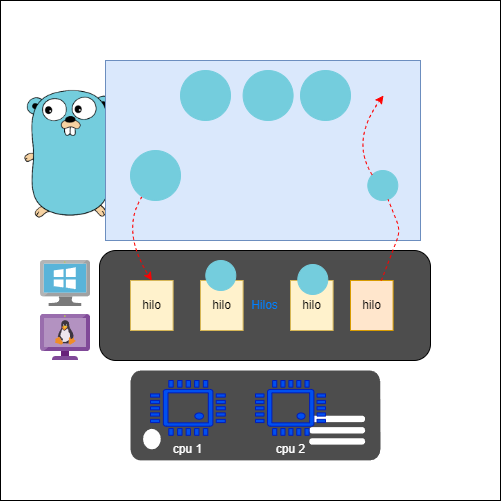

# GolangPractice
Repositorio para guardar avances de aprendizaje y documentación sobre el lenguaje GO
[Sitio oficial][golang-oficial-site]

# Historia y caracteristicas principales

Golang, es un lenguaje de programación desarrollado por Google. Fue anunciado en noviembre de 2009 y lanzado públicamente en marzo de 2012. El equipo de desarrollo de Go incluyó a Robert Griesemer, Rob Pike y Ken Thompson, todos con una sólida experiencia en el campo de la programación.

Entre sus principales caracteristicas tenemos:
- Es **versatil** ya que combina caracteristicas de lenguajes de bajo nivel como **C++** puede ser usado para creación de software de sistema, como por ejemplo, controladores, comandos de SO, agentes etc.
- Es **rápido** ya que sus ejecutables se distribuyen en codigo nativo sin necesidad de maquinas virtuales como Java o interpretes como python. Go se enfoca en la eficiencia en términos de consumo de memoria y rendimiento. Es particularmente adecuado para aplicaciones de alto rendimiento y sistemas distribuidos.
- Es **compacto** Genera ejecutables pequeños sin necesidad de bibliotecas externas o entornos de ejecución.
- Es **muy rápido compilando** Está enfocado en **CI/CD**  po lo cual está enfocado en la productividad.
- Es **seguro** Go tiene un recolector de basura eficiente que gestiona automáticamente la memoria, lo que facilita la escritura de código sin preocuparse demasiado por la gestión de la memoria.
- Es **sencillo** Facil de leer y de entender para disminuir el tiempo en revisión entre los equipos de desarrollo.
- **Concurrencia Nativa** Go tiene soporte integrado para la concurrencia y la programación concurrente. Los goroutines (hilos ligeros) y los canales son parte integral del lenguaje y facilitan la escritura de programas concurrentes.
- Es **completo** la distribución estandar provee casi todas las herramientas necesarias para crear cualquier funcionalidad.
- **Garantía de Estructura de Código** Go proporciona herramientas como gofmt para formatear automáticamente el código de manera consistente, lo que ayuda a mantener una estructura de código uniforme en proyectos grandes.
- Es **Open Source** todo el codigo asi como sus librerias son de codigo abierto.

# Comandos Básicos

- **go run**: Este comando se utiliza para compilar y ejecutar programas Go.
- **go build**: Compila el programa y genera un ejecutable. Puedes ejecutar el programa compilado por separado.
- **go install**: Instala el paquete o programa en el directorio bin de tu espacio de trabajo.
- **go get**: Descarga e instala paquetes o bibliotecas de otros repositorios.
- **go fmt**: Formatea el código fuente de acuerdo con las convenciones de formato de Go. Ayuda a mantener un estilo de código consistente.
- **go vet**: Examina el código en busca de errores comunes. Ayuda a encontrar problemas en el código que podrían no ser evidentes.
- **go test**: Ejecuta pruebas en el código. Go tiene un enfoque integrado para las pruebas unitarias, y este comando ejecutará los tests en el código.
- **go mod**: Gestiona módulos Go. Los módulos son una forma de gestionar dependencias en proyectos Go. Algunos subcomandos de go mod incluyen **init, tidy, vendor**, entre otros.
- **go doc**: Muestra la documentación para el paquete o símbolo especificado.

# Primer programa con GO

Crea un archivo que se llame hola.go y itroduce el siguiente contenido.
```go
package main

import "fmt"

// Función principal "main"
func main() {
	// Muestra un saludo en pantalla
	fmt.Println("Hola mundo desde go")
}
```

De este codigo podemos ver que el punto de arranque del programa es el codigo contenido en la función main().<br>
Cada fichero está encabezado por una directiva package que otroga un nombre comun para el paquete, el punto de inicio de un programa debe estar encabezado por el package main.<br>
Se pueden incorporar funcionalidades desde otras librerias con la directiva import.<br>
Para ejecutar el programa, desde la shell se introduce lo siguiente
```bash
go run hola.go
```
Esto permite ejecutar el programa, para crear un ejecutable se debe usar el comando
```bash
go build hola.go
```
Esto creara un ejecutable para la misma arquitectura desde la cual se realiza el compilado, para realizar compilados para otras arquitecturas se puede utilizar variables de entorno **GOOS** y **GOOARCH**
```bash
GOOS=windows GOARCH=386 go build hola.go
GOOS=linux GOARCH=arm64 go build hola.go
```
Los ateriores comandos generarian ejecutables para windows x86 y para linux arm64 respectivamente.

# Sintaxis básica de GO

Go es un lenguaje de timado estatico por lo cual cada variable solo podrá guardar valores de su mismo tipo; go provee los siguientes tipos de datos básicos:

## **Enteros**
    - **int**: Tipo de datos para enteros con signo (puede ser int8, int16, int32, int64).
    - **uint**: Tipo de datos para enteros sin signo (puede ser uint8, uint16, uint32, uint64).
    - **uintptr**: Tipo para almacenar valores sin signo de tamaño suficiente para contener los bits no interpretados del valor de un puntero.
## **Punto flotante**
    - **float32** Tipo de datos para números de punto flotante de 32 bits.
    - **float64** Tipo de datos para números de punto flotante de 64 bits.
## **Complejos**
    - **complex64**: Tipo de datos para números complejos con partes reales e imaginarias de 32 bits.
    - **complex128**: Tipo de datos para números complejos con partes reales e imaginarias de 64 bits.
## **Booleano**
    - **bool**: Tipo de datos que representa valores booleanos (true o false).
## **Cadena de texto:** 
Go permite definir una variable de cadena de texto ingresando cualquier dato ente " tambien soporta caracteres de escape para el uso de funcionalidades dentro del texto.<br>
En Go, los caracteres de escape (\) en las cadenas de texto (variables de tipo string) se utilizan para representar caracteres especiales o secuencias de escape. Estos caracteres permiten incluir caracteres que de otra manera serían difíciles de representar directamente en una cadena o que tienen un significado especial en el contexto de las cadenas de texto. Aquí hay algunos ejemplos de caracteres de escape comunes en Go

- \n - Salto de línea
- \t - Tabulación
- \r - Retorno de carro
- \b - Retroceso

Tambien es posible usar indicador de acento grave(\`) para realizar saltos de linea y demas por ejemplo:
```go
texto:= `- Esta es una linea
- esta es otra linea y todo está en la misma variable`
```
    - **string**: Tipo de datos para representar cadenas de texto.
## **Carácter:**
    - **byte** (uint8): Tipo de datos para representar un solo byte (sinónimo de uint8).
    - **rune** (int32): Tipo de datos para representar un solo carácter Unicode (sinónimo de int32).
## **Puntero:**
    - **\*T**: Tipo de datos de puntero, donde T es el tipo apuntado.
## **Estructuras y Tipos Compuestos:**
    - **struct**: Tipo de datos que permite agrupar diferentes tipos de datos bajo una estructura.
    - **array**: Tipo de datos para representar arreglos de longitud fija.
    - **slice**: Tipo de datos para representar slices, que son segmentos flexibles de arreglos.
    - **map**: Tipo de datos para representar mapas o diccionarios.
## **Interfaces:**
    - **interface**: Tipo de datos que define un conjunto de métodos que un tipo debe implementar para satisfacer la interfaz.
## **Funciones:**
    - **func**: Tipo de datos que representa funciones.
## **Canal:**
    - **chan**: Tipo de datos para representar canales, utilizados para la comunicación entre goroutines.


Go permite definir una variable de cadena de texto ingresando cualquier dato ente " tambien soporta caracteres de escape para el uso de funcionalidades dentro del texto.<br>
En Go, los caracteres de escape (\) en las cadenas de texto (variables de tipo string) se utilizan para representar caracteres especiales o secuencias de escape. Estos caracteres permiten incluir caracteres que de otra manera serían difíciles de representar directamente en una cadena o que tienen un significado especial en el contexto de las cadenas de texto. Aquí hay algunos ejemplos de caracteres de escape comunes en Go

- \n - Salto de línea
- \t - Tabulación
- \r - Retorno de carro
- \b - Retroceso

Tambien es posible usar indicador de acento grave(\`) para realizar saltos de linea y demas por ejemplo:
```go
texto:= `- Esta es una linea
- esta es otra linea y todo está en la misma variable`
```

## Definición de variables
La manera de definir una variable en go especificando el tipo de dato y el valor es `var <nombre> <tipo> [ = <valor>]`
```go
var dias int
var edad int = 12
```
Sino se provee un valor inicial las variables se iniciaran automaticamente con el valor cero para cada tipo de dato ej:
- int = 0
- bool = false
- string = ""
Para facilitar se puede omitir la palabra var y el tipo con el operador de inicialización(:=)
```go
meses := 12
```
cAl usar el operador de inicialización el compilador de Go inferirá el tipo de la variable, el operador de inicialización solo puede ser usado como su nombre lo indica para inicializar la variable, si esta cambia en algun momento se debe usar el de asignación (=)

## conversión explicita de tipos

En Go, la conversión explícita de tipos se realiza cuando deseas convertir un valor de un tipo a otro de manera explícita mediante el uso de operadores de conversión. Esto se utiliza cuando los tipos de datos son diferentes y deseas convertir un valor de un tipo a otro compatible.
La sintaxis básica para la conversión de tipo explicita en Go es: 
```go
nuevoTipo(expresion)
```
Donde nuevoTipo es el tipo al que deseas convertir y expresion es el valor que deseas convertir.<br>
Un ejemplo completo es:
```go
package main

import "fmt"

func main() {
    // Conversión explícita de int a float64
    entero := 42
    flotante := float64(entero)
    fmt.Printf("Entero: %d, Flotante: %f\n", entero, flotante)

    // Conversión explícita de float64 a int
    otroFlotante := 3.14
    otroEntero := int(otroFlotante)
    fmt.Printf("Flotante: %f, Entero: %d\n", otroFlotante, otroEntero)

    // Conversión explícita de int a string
    numero := 123
    cadena := string(numero)
    fmt.Printf("Número: %d, Cadena: %s\n", numero, cadena)
}
```
En el primer ejemplo, convertimos un entero (entero) a un float64. En el segundo ejemplo, convertimos un float64 (otroFlotante) a un entero. Y en el tercer ejemplo, intentamos convertir un entero (numero) a una cadena (cadena).

Es importante mencionar que la conversión explícita solo tiene sentido entre tipos que sean compatibles entre sí. Por ejemplo, no puedes convertir directamente entre tipos incompatibles como int y string sin realizar una conversión más compleja.

Además, ten en cuenta que la conversión de tipos puede resultar en pérdida de información. Por ejemplo, al convertir de float64 a int, se truncarán los decimales y se perderá precisión. Por lo tanto, se debe realizar con precaución y considerar posibles pérdidas de datos.

## Constantes
Una constante es un valor que como su nombre lo indica será el mismo durante la ejecución del programa y no se puede cambiar, se define de la siguiente manera:
```go
const Pi = 3.1416
// 0
const Pi float64 = 3.1416
```
Al definir varias constantes se pueden agrupar semanticamente dentro de la misma directiva const:
```go
const (
    Font = "Times New Roman"
    Size = 12
    Bold = false
)
```
# Operadores numéricos


En Go, existen varios operadores numéricos que se utilizan para realizar operaciones matemáticas en valores numéricos. Aquí te presento una lista de los operadores numéricos más comunes en Go:
- Suma (+)
- Resta (-)
- Multiplicación (*)
- División (/)
- Módulo (%)
- Incremento (++)
- Decremento (--)
- Operadores de Asignación (+=, -=, *=, /=, %=):
    - Se utilizan para realizar una operación y asignar el resultado directamente a una variable.
```go
resultado := 10
resultado += 5  // Equivalente a resultado = resultado + 5
```
Estos son los operadores numéricos básicos en Go. Además de estos, Go también proporciona operadores bit a bit para manipulación de bits, pero esos son más avanzados y se utilizan en situaciones específicas.

El orden de precedencia en Go determina el orden en el que se evalúan las expresiones cuando hay múltiples operadores en una misma expresión. En Go, las expresiones se evalúan de izquierda a derecha siguiendo un orden específico de precedencia. Aquí está el orden de precedencia de los operadores en Go, de mayor a menor:
- ++, -- (postfijo)
- +, - (unario), !, ^ (bit a bit, complemento)
- *, /, %, <<, >>, & (bit a bit, AND), &^ (bit a bit, AND NOT)
- +, - (binario), | (bit a bit, OR), ^ (bit a bit, XOR)
- ==, !=, <, <=, >, >=
- <-
- &&
- ||
Esto significa que los operadores con mayor precedencia se evalúan primero. Por ejemplo, en la expresión `a + b * c`, la multiplicación **b * c** se evaluará antes de sumar el resultado **a**, debido a la mayor precedencia de * en comparación con +.

Es importante tener en cuenta que los paréntesis () pueden ser utilizados para alterar el orden de precedencia y forzar que ciertas partes de la expresión se evalúen antes que otras. Las expresiones dentro de paréntesis se evalúan primero.

# Operadores numericos de comparación 

Los operadores de comparación en Go permiten comparar expresiones numéricas y producir un resultado booleano (true o false). 
Los operadores de comparación en Go son:
- **Igualdad** (==): Comprueba si dos valores son iguales.
```go
resultado := (a == b)
```
- **Desigualdad** (!=): Comprueba si dos valores son diferentes.
```go
resultado := (a != b)
```
- **Menor que** (<): Comprueba si el valor de la izquierda es menor que el valor de la derecha.
```go
resultado := (a < b)
```
- **Menor o igual** que (<=): Comprueba si el valor de la izquierda es menor o igual al valor de la derecha.
```go
resultado := (a <= b)
```
- **Mayor que** (>): Comprueba si el valor de la izquierda es mayor que el valor de la derecha.
```go
resultado := (a > b)
```
- **Mayor o igual que** (>=): Comprueba si el valor de la izquierda es mayor o igual al valor de la derecha.
```go
resultado := (a >= b)
```
Estos operadores se utilizan comúnmente en estructuras de control de flujo condicional, como las declaraciones if, else if y switch. Aquí hay un ejemplo:

```go
package main

import "fmt"

func main() {
    a := 5
    b := 10

    if a == b {
        fmt.Println("a es igual a b")
    } else if a < b {
        fmt.Println("a es menor que b")
    } else {
        fmt.Println("a es mayor que b")
    }
}
```
En este ejemplo, se utilizan los operadores de comparación ==, < y > para determinar la relación entre las variables a y b y imprimir un mensaje correspondiente.

# Operadores de tipo String

En Go, los operadores de cadena (string) se utilizan para realizar operaciones específicas en cadenas de texto. Algunos de los operadores y operaciones más comunes que se puede realizar con cadenas en Go son:

- **Concatenación (+)**: Se utiliza para unir dos cadenas.
```go
cadena1 := "Hola"
cadena2 := " Mundo"
resultado := cadena1 + cadena2
```

En este ejemplo, resultado contendrá la cadena "Hola Mundo".

- **Comparación (==, !=, <, <=, >, >=)**: Los operadores de comparación se pueden utilizar para comparar cadenas lexicográficamente.
```go
cadena1 := "abc"
cadena2 := "def"

igual := (cadena1 == cadena2)
menorQue := (cadena1 < cadena2)
```
- **Longitud (len):** La función len se utiliza para obtener la longitud de una cadena, es decir, el número de bytes que contiene.
```go
cadena := "Hola"
longitud := len(cadena)  // longitud será 4
```

- **Acceso a caracteres:** Puedes acceder a un carácter específico de una cadena utilizando la notación de índice.
```go
cadena := "Hola"
primerCaracter := cadena[0]  // primerCaracter será 'H'
```
> Nota: En Go, las cadenas son secuencias inmutables de bytes, y cada carácter es un byte.

- **Slicing:** Puedes obtener subcadenas utilizando el slicing.
```go
cadena := "abcdefgh"
subcadena := cadena[1:5]  // subcadena será "bcde"
```
- **Conversiones entre string y []byte:** Puedes convertir una cadena a un slice de bytes ([]byte) y viceversa.
```go
cadena := "Hola"
bytes := []byte(cadena)
```
Esto es útil si necesitas modificar la cadena, ya que las cadenas son inmutables, pero los slices de bytes no lo son.
- **Funciones del paquete strings:** Go proporciona el paquete strings que incluye funciones para realizar diversas operaciones en cadenas, como Join, Split, Contains, Replace, etc.
```go
import "strings"

cadena := "Hola Mundo"
palabras := strings.Split(cadena, " ")
```

Estos son algunos de los operadores y funciones que puedes utilizar para trabajar con cadenas en Go entre otras

# Operadores booleanos

Cualquier variable o expresión que retorne un valor booleano pueder ser comparada con otro mediante operadores lógicos como los siguientes

|Operador   | Descripsión   | Ejemplo|
|:---------:|---------------|:-------:|
|**&&**         |Devuelve true si ambas expresiones son verdaderas, de lo contrario, devuelve false. |`resultado := expresion1 && expresion2`|
|**\|\|** |Devuelve true si al menos una de las expresiones es verdadera, de lo contrario, devuelve false |`resultado := expresion1 \|\| expresion2`|
|!|Niega la expresión booleana, convirtiendo true en false y viceversa.| `resultado := !expresion` |

# Operadores a nivel de BIT

Estos operadores a nivel de bit se utilizan para realizar manipulaciones en los bits individuales de los operandos. Son comúnmente utilizados en situaciones que involucran manipulación de datos a nivel de bits, como operaciones con máscaras, criptografía, y manipulación de datos en sistemas integrados.

|Operador   | Descripsión   | Ejemplo|
|:---------:|---------------|:-------:|
|**&**|Realiza una operación AND bit a bit entre dos operandos. |`0b_1010 & 0b_1100 == 0b_1000`|
|**\|**|Realiza una operación OR bit a bit entre dos operandos. |`0b_1010 \| 0b_1100 == 0b_1110`|
|**^**|Realiza una operación XOR bit a bit entre dos operandos.|`0b_1010 ^ 0b_1100 == 0b_0110`|
|**^**|NOT, cuando se aplica delante de un solo operador invierte el valor de cada digito|`^0b_100110 == 0b_011001`|
|**<<**|Desplaza los bits de la expresión de la izquierda hacia la izquierda por la cantidad especificada.|`0b_1001 << 2 == 0b_100100`|
|**>>**|Desplaza los bits de la expresión de la derecha hacia la derecha por la cantidad especificada.|`0b_1001 >> 2 == 0b_0010`|


# Salida estandar de datos

En Go, la salida estándar de datos se maneja mediante el paquete fmt. Este paquete proporciona funciones para formatear y imprimir datos en la salida estándar (normalmente la consola). Algunos de los aspectos básicos de cómo trabajar con la salida estándar en Go:

- **Función Print:** La función Print de fmt se utiliza para imprimir texto en la salida estándar.
```go
package main

import "fmt"

func main() {
    fmt.Print("Hola Mundo")
}
```
> En este ejemplo, "Hola Mundo" se imprimirá en la consola sin agregar un salto de línea al final.

- **Función Println:** La función Println imprime una línea de texto en la salida estándar, y agrega automáticamente un salto de línea al final.
```go
package main

import "fmt"

func main() {
    fmt.Println("Hola")
    fmt.Println("Mundo")
}
```

Esto producirá una salida como:
```txt
Hola
Mundo
```
- **Función Printf:** La función Printf se utiliza para imprimir texto formateado. Puedes incluir marcadores de posición en el texto y proporcionar valores para ser insertados.
```go
package main

import "fmt"

func main() {
    nombre := "Juan"
    edad := 30

    fmt.Printf("Nombre: %s, Edad: %d\n", nombre, edad)
}
```
Esto producirá una salida como:

```txt
Nombre: Juan, Edad: 30
```
Aquí, %s es un marcador de posición para una cadena, y %d es un marcador de posición para un entero.

- **Redirección de la Salida:** Puedes redirigir la salida a otros lugares que implementen la interfaz io.Writer, no solo a la consola. Por ejemplo, puedes redirigir la salida a un archivo.
```go
package main

import (
    "fmt"
    "os"
)

func main() {
    archivo, err := os.Create("salida.txt")
    if err != nil {
        fmt.Println("Error al crear el archivo:", err)
        return
    }
    defer archivo.Close()

    fmt.Fprintln(archivo, "Hola Mundo")
}
```

> En este ejemplo, la salida se redirige al archivo "salida.txt" en lugar de la consola.

Estas son algunas de las formas básicas de trabajar con la salida estándar en Go.

# Entrada de datos

En Go, la entrada de datos se puede realizar utilizando el paquete fmt para leer desde la entrada estándar o utilizando el paquete bufio para leer líneas completas. Algunos ejemplos básicos de cómo realizar la entrada de datos en Go:

- Usando **fmt.Scan** para leer valores desde la entrada estándar:

fmt.Scan se utiliza para leer valores desde la entrada estándar y asignarlos a variables.
```go
package main

import "fmt"

func main() {
    var nombre string
    var edad int

    fmt.Print("Ingrese su nombre: ")
    fmt.Scan(&nombre)

    fmt.Print("Ingrese su edad: ")
    fmt.Scan(&edad)

    fmt.Printf("Hola, %s. Tu edad es %d\n", nombre, edad)
}
```

Este programa solicitará al usuario que ingrese su nombre y edad, y luego imprimirá un saludo personalizado.

Usando fmt.Scanf para leer valores con formato desde la entrada estándar:

fmt.Scanf permite leer valores desde la entrada estándar utilizando un formato específico.
```go
package main

import "fmt"

func main() {
    var nombre string
    var edad int

    fmt.Print("Ingrese su nombre y edad: ")
    fmt.Scanf("%s %d", &nombre, &edad)

    fmt.Printf("Hola, %s. Tu edad es %d\n", nombre, edad)
}
```

Aquí, el usuario debe ingresar el nombre seguido de la edad, y los valores se asignarán a las variables correspondientes.

Usando bufio.NewReader para leer líneas completas desde la entrada estándar:

bufio.NewReader se puede utilizar para leer líneas completas desde la entrada estándar.
```go
package main

import (
    "bufio"
    "fmt"
    "os"
)

func main() {
    fmt.Print("Ingrese una línea de texto: ")

    lector := bufio.NewReader(os.Stdin)
    linea, err := lector.ReadString('\n')
    if err != nil {
        fmt.Println("Error al leer la línea:", err)
        return
    }

    fmt.Println("Ingresaste:", linea)
}
```

Este programa solicitará al usuario que ingrese una línea de texto, y luego imprimirá la línea ingresada.

# Control de flujo

En Go, al igual que en otros lenguajes de programación, el control de flujo se refiere a la capacidad de tomar decisiones y realizar acciones en función de ciertas condiciones. Los constructores básicos de control de flujo en Go son las declaraciones if, else, switch, for, y select.

- **Declaración if:** La declaración if se utiliza para ejecutar un bloque de código si una condición es verdadera.
```go
if condicion {
    // Bloque de código a ejecutar si la condición es verdadera
} else if otraCondicion {
    // Bloque de código a ejecutar si otraCondición es verdadera
} else {
    // Bloque de código a ejecutar si ninguna de las condiciones anteriores es verdadera
}
```

- **Declaración switch:** La declaración switch se utiliza para evaluar múltiples condiciones en función del valor de una expresión.
```go
switch expresion {
case valor1:
    // Bloque de código a ejecutar si expresion == valor1
case valor2:
    // Bloque de código a ejecutar si expresion == valor2
default:
    // Bloque de código a ejecutar si ninguno de los casos anteriores es verdadero
}
```

- **Declaración for:** La declaración for se utiliza para crear bucles. Puedes tener diferentes formas de la declaración for, como for i := 0; i < 5; i++ o for condicion {} para un bucle mientras.
```go
for i := 0; i < 5; i++ {
    // Bloque de código a ejecutar en cada iteración
}

for condicion {
    // Bloque de código a ejecutar mientras la condición sea verdadera
}
```

- **Declaración select:** La declaración select se utiliza para implementar un control de flujo concurrente. Se utiliza con canales para seleccionar la operación que puede proceder.
```go
select {
case mensaje1 := <-canal1:
    // Bloque de código a ejecutar si se recibe un mensaje en canal1
case canal2 <- mensaje2:
    // Bloque de código a ejecutar si se envía un mensaje a canal2
default:
    // Bloque de código a ejecutar si ninguna de las operaciones anteriores está lista
}
```

Estos son algunos de los constructores básicos de control de flujo en Go. Además, Go ofrece otras características interesantes, como la posibilidad de realizar asignaciones condicionales y la capacidad de retornar múltiples valores desde una función, que pueden influir en cómo se controla el flujo del programa. Es importante entender y utilizar estas estructuras de control de flujo para escribir código eficiente y fácil de entender.

# Apuntadores

Un apuntador en Go es una variable que almacena la dirección de memoria de otra variable. En otras palabras, un apuntador apunta a la ubicación en memoria de un valor específico en lugar de contener el valor en sí mismo. Los apuntadores permiten manipular y referenciar directamente la memoria, lo que puede ser útil en diversas situaciones

En GO los apuntadores tienen un tipo asociado es decir que no se puede apuntar a el variables de un tipo diferente.

## Definir un apuntador

Un apuntador se define como variable agregando un asterisco (*) delante del tipo
```go
var ptr1 *int // apuntador a un entero
var ptr2 *bool // apuntador a un booleano
```
## Referencia a nil

Cuando un apuntador no se inicializa con un valor por defecto se entiende como un apuntador a nil o básicamente a ninguna parte.
el valor **nil** se puede utilizar para reiniciar el valor de un apuntador.
```go
var pi *int
pi = nil
if pi == nil {
    fmt.Print("¡No se puede hacer nada con este apuntador ")
    fmt.Println("porque no apunta a nada! ")
}
```
Cuando un apuntador apunta a la dirección nil este no se puede usar para lee o modificar valores ya que el valor apuntado no existe.

## Apuntando a una variable
 
El operador ampersand (&) retorna la dirección de memoria de una variable
```go
mivariable := 10
var puntero *int
puntero = &mivariable
```

En el ejemplo anterior se puede ver como el apuntador ahora contiene la dirección de memoria de mivariable

## Leer o Modificar el valor apuntado

A través de un apuntador se puede modificar o leer el valor que contiene un espacio de memoria.
El operador asterisco (*) permite acceder al valor de una variable apuntada
```go
i := 10
p := &i
a := *p
*p = 21
```


# Funciones

Las funciones en Go son bloques de código que realizan una tarea específica y pueden ser invocadas desde otras partes del programa. Algunas características y conceptos importantes relacionados con las funciones en Go son:

- **Declaración de Funciones**: La declaración de una función en Go sigue la siguiente estructura básica:

```go
func nombreDeLaFuncion(parametro1 tipo, parametro2 tipo) tipoDeRetorno {
    // Cuerpo de la función
    // ...
    return valorDeRetorno
}
```

- **func**: Palabra clave utilizada para declarar una función.
- **nombreDeLaFuncion**: El nombre de la función.
- **(parametro1** tipo, parametro2 tipo): Lista de parámetros con sus tipos.
- **tipoDeRetorno**: Tipo de dato que la función retorna.
- **return** valorDeRetorno: Declaración para devolver un valor al final de la función.


**Ejemplo Básico:**
```go
package main

import "fmt"

func sumar(a int, b int) int {
    resultado := a + b
    return resultado
}

func main() {
    resultadoSuma := sumar(3, 4)
    fmt.Println("La suma es:", resultadoSuma)
}
```
En este ejemplo, la función sumar toma dos parámetros de tipo entero y devuelve la suma de estos dos números. Luego, en la función main, se invoca sumar con los valores 3 y 4 y se imprime el resultado.

- **Múltiples Resultados de Retorno**: Go permite que una función devuelva múltiples valores y tambien permite nombrar estos valores.

```go
func dividir(dividendo, divisor int) (cociente, resto int) {
    cociente = dividendo / divisor
    resto = dividendo % divisor
    return cociente, resto
}
```

- **Funciones Anónimas (Closures)**: En Go, también puedes declarar funciones anónimas, que son funciones sin un nombre definido. Se utilizan comúnmente en situaciones donde se requiere una función como argumento.

```go
func main() {
    // Función anónima que duplica un número
    duplicar := func(x int) int {
        return x * 2
    }

    resultado := duplicar(5)
    fmt.Println("El resultado es:", resultado)
}
```

- **Funciones Variádicas:** Go permite la definición de funciones con un número variable de argumentos.

```go
func sumaVariadica(numeros ...int) int {
    suma := 0
    for _, numero := range numeros {
        suma += numero
    }
    return suma
}
```

- **Funciones como Valores:** En Go, las funciones son ciudadanos de primera clase, lo que significa que pueden ser asignadas a variables y pasadas como argumentos a otras funciones.

```go
func operacion(a, b int, operador func(int, int) int) int {
    return operador(a, b)
}

func multiplicar(x, y int) int {
    return x * y
}

func main() {
    resultado := operacion(3, 4, multiplicar)
    fmt.Println("El resultado de la multiplicación es:", resultado)
}
```


# Identificador vacio _

El identificador vacio ( _ ) permite descartar valores retornados por una función que no se van a necesitar, es necesario asignar a este identificador cualquier valor que no se use ya que **Go no permite la declaración de variables que no se usen** ejemplo:
```go
func MaxMin(a, b int) (max int, min int) {
    if a > b{
        max = a
        min = b
    } else {
        min = a
        max = b
    }
    return
}
// si queremos descartar uno de los valores en el retorno

max, _ :=MaxMin(3,6)
```

# Literales de función

En Go las funciones son un tipo de dato tambien, asi que se pueden crear variables del tipo función, por ejemplo la siguiente variable apuntaria a una función que no recibe argumento y retorna un numero entero `var generador func() int`.
> Las funciones son pasadas como referencia y no como valor
A la variable anterior se le puede asignar un literal de función en cualquier parte del programa y se podrá invocar la función a través de dicha variable, los literales tambien pueden acceder a valores fuera de su ambito
```go
contador := 0
generador = func() int {
    contador++
    return contador
}
fmt.Println("Generador contador:",
            generador(), generador(), generador())
```
Lo anterior daria como resultado:
```txt
generador contador: 1, 2, 3
```

# Estructuras de datos lineales

Al igual que en la mayoria de lenguajes de programación GO permite crear agrupaciones de datos de un mismo tipo en una variable y acceder a ella segun el indice, estas agrupaciones son conocidas como lineales porque sus datos están ordenados segununa sola dimensión.

Go permite crear dos tipos de datos lineales, los **vectores (arrays)** y las **porciones (slice)**, que definen vistas sobre otros vectores y proporcionan mayor dinamismo y manejabilidad


# Vectores o Arrays:

Un array en Go es una colección de elementos del mismo tipo que se guardan en espacios continuos de memoria con una longitud fija. 

La longitud del array es parte de su tipo, lo que significa que no puede cambiar después de su creación y no se puede hacer operaciones con arrays que tengan distintas longitudes.

```go
// Declaración y creación de un array de enteros con longitud 3
var miArray [3]int
miArray[0] = 1
miArray[1] = 2
miArray[2] = 3
```

Tambien es posible definir matrices de vectores de diferentes dimensiones

```go
var tableroAjedrez [8][8]uint8
```

Los operadores de asignación (=) o declaración (:=) copian por valor el contenido de un vector

# Porcione o Slices:

Un slice es una porción flexible de un array. A diferencia de los arrays, los slices son dinámicos y su tamaño puede cambiar.

```go
// Creación de un slice
miSlice := []int{1, 2, 3, 4, 5}

// Agregar un elemento al final del slice
miSlice = append(miSlice, 6)
```
Las principales diferencias entre un slice y un array son:
- Si se asigna el valor de un slice a otro del mismo tipo con los operadores **= o :=**, lo valores del slice no se copiaran sino que ambos apuntaran al mismo ya que las variables **apuntan al mismo vector**.
- El operador de comparación **==** solo regresara true si ambas apuntan al mismo slice.
- A diferencia de un array el tamaño de un slice no hace parte de su tipo.
- A partir de un slice se pueden crear sub slice tambien llamados vistas
> Una de las diferencias mas grandes entre los array y los slice es que los slice operan por referencia y los array por valor, un slice internamente no se limita en sus elementos y puede crecer

```go
p := []int{1,2,3,4} // Slice
v1 := [4]int{1,2,3,4} // array
v2 := [...]int{1,2,3,4} //array
```
## Medir Dimensiones con len y cap
Se puede medir las dimensiones de los slice con la función **len** la cual retorna el numero de elementos que contiene un slice.

Se puede usar la función **cap** para saber la capacidad totasl de un slice, es decir cuantos elementos podrá almacenar hasta que sea necesario reservar mas espacio en memoria

```go
var sl []int
fmt.Printf("Longitud %v. capacidad %v\n", len(sl), cap(sl))
sl.append(sl, 1, 2, 3, 4)
fmt.Printf("Longitud %v. capacidad %v\n", len(sl), cap(sl))
sl.append(sl, 5)
fmt.Printf("Longitud %v. capacidad %v\n", len(sl), cap(sl))
```
la salida del programa será:
```txt
Longitud 0. capacidad 0
Longitud 4. capacidad 4
Longitud 5. capacidad 8
```
Al principio la referencia del slice sl es **nil** ya que solo es declarado pero no inicializado.<br>
Cuando se invoca **append** por primera vez se crea una porciaon en la que caben los argumentos sucesivos y se copian allá.<br>
Como la congitud de la primera porción de memoria es igual a la capacidad total de elementos contenidos cuando se realiza un segundo **append** se crea un nuevo slice con el doble de capacidad y se copian los elementos del slice original y luego se añade el otro elemento

## Controlar tamaño inicial con make

El crecimiento dinamico de un slice puede ser perjudicial para el rendimiento de la aplicación ya que si no cuenta con suficiente capacidad para crecer deberá moverse a un nuevo espacio de memoria copiando cada uno de sus elementos, es por esto que si de antemano se conoce los requerimientos de la capacidad del slice la función **make** da la flexibilidad para crear un slice de una capacidad dada 
`<slice> := make([]<tipo>, <longitud> [, <capacidad>] )`
la capacidad es opcional, sin embargo, por convención se sugiere crear slice con longitud 0 con una capacidad especifica, por ejemplo:
```go
altaCapacidad := make([]float32, 0 ,2048)
``` 
El ejemplo anterior reservara una porción de memoria para 2048 numeros de tipo float32

## Copiar slice con copy

Teniendo en cuenta que los slice son tratados por referencia y no por valor como los array entonces es necesario usar la función copy para realizar un duplicado de los datos de un slice `func copy(destino, fuente[]T) int` <br>
Si la fuente y destino tienen longitudes diferentes entonces solo se copian los elementos que quepan en la capacidad mas corta. <br>
La función copy retorna la cantidad de numeros copiados
```go
original := []int{1, 2, 3, 4, 5}
copia := make([]int, len(original) )
n  := copy(copia, original)
fmt.Println(n, "numeros copiados:", copia)
```
salida por pantalla
```txt
5 numeros copiados: {1, 2, 3, 4, 5}
```
## Crear vistas desde un slice

Se pueden crear nuevos slice a partir de un slice existente indicando el indice inicial y el final separados por dos puntos (**:**) `<porcion>[<inicio>:<final>]` el indice de inicio es inclusivo y el final es exclusivo
> una vista no copia valores solo hace una referencia a la zona de memoria.


# Funciones con argumentos variables 

Se pueden declarar funciones con un numero indeterminado de variables a ser operadas; para realizar esto se prefijan tres puntos seguidos (...) donde se declara el argumento, ejmplo: `func Suma(n ...int) int` la función Suma acepta un numero variable de argumentos de enteros, para trabajar con este tipo de argumentos se tratan como si fueran un **slice**
```go
func Suma(n ...int) int {
    total := 0
    for _, s := range n {
        total += s
    }
    return total
}
```
## El operador difusor (spread operator ...)

Si se deseara pasar los valores de un slice a una función como la anterior se debe tener en cuenta que al ser tratados como referencia no se pueden agregar dirtectamente a los argumentos, para esto se usa el operador difusor **...** ejemplo:
```go
valores := []int{1, 2, 3, 4, 5, 6}
total := Suma(valores...)
```
Tambien se puede usar el operador difusor para concatenar dos slice
```go
sl1 :=  []int{1,2,3}
sl2 := []int{4,5,6}
sl1 := append(s,sl2...)
fmt.Println("Concatenación =",sl1)
```
```txt
concatenación = [1 2 3 4 5 6]
```

# Cadenas de texto (Strings)

Internamente las cadenas de texto son estructuras lineales de bytes que codifican texto bajo el estandar **UTF-8** los caracteres occidentales asi como la simbologia mas comun suelen ocupar un byte basandose en el antiguo codigo **ASCII** y carácteres especiales como tildes y demas ocuparan rangos de uno a cuatro bytes, a diferencia de los arrays y los slice los datos de un string son **inmutables** por lo tanto cualquier operación sobre un strign dará como resultado uno nuevo el cual es una copia con los cambios solicitados.
- La comparación de cadenas se realizará caracter por caracter
- los operadores de igualdad (==) o diferencia (!=) se pueden utilizar al igual que los operadores mayor (>) y menor que (<)
- Aunque los string se tratan por referencia estos no pueden apuntar a nil, en vez de eso son inicializadas con un string vacio ""
- La función len retorna la longitud del string en bytes, es decir no regresa el numero de caracteres sino la cantidad de bytes que usan estos caracteres segun el estandar **UTF-8**.
- El operador **+** permite concatenar cadenas


# Mapas

Un mapa es una colección no ordenada de pares clave-valor, donde cada clave es única y puede ser de cualquier tipo, los datos son ordenados de manera lineal pero asociados a su clave en vez de a un indice, la forma de declarar un mapa es `<variable> := map[<tipo_clave>:]<tipo_valor>{}` o prerrellenando con algunas claves.
`<variable> := map[<tipo_clave>]<tipo_valor>{ <clave_a> : <valor_a>, <clave_b> : <valor_b> }`

```go
// Creación de un mapa
capitales := map[string]string{
    "España": "Madrid",
    "Colombia": "Bogotá",
    "UK" : "Londres"
}
```

- **Acceder a elementos**

Para agregar un elemento a un mapa se debe continuar con el patron de creación `<mapa>[<clave>] = <valor>` si se elige una clave existente se sobre escribirá el valor.

- **Eliminar valores**

Para eliminar valores Go entrega la función delete la cual recibe un map y una clave como parametros `delete(<mapa>, <clave>)`

- **Recorrer un mapa**

Para recorrer todos los valores de un mapa se usa la función range de la siguiente manera
```go
capitales := map[string]string{
    "España": "Madrid",
    "Colombia": "Bogotá",
    "UK" : "Londres"
}
for pais, capital := range capitales{
    /*Codigo a repetir por cada objeto del mapa*/
    fmt.Printf("La capital de %s es %s\n", pais, capital)
}
```

# Conjuntos Struc

Los conjuntos son estructuras de datos que nos permiten:
- insertar elementos no duplicados
- Eliminar elementos
- Contar el numero de elementos
- Comprobar si un elemento existe
- Recorrer los elementos uno a uno

En el siguiente ejemplo se muestran 6 numeros aleatorios pertenecientes a un sorteo de loteria por lo cual es importante que no se repitan, se utiliza un struct constroido a partir de un map cuya clave es un numero entero y su valor es una instancia de la estructura vacia **struct{}** 

```go
fmt.Println("Los numero ganadores de la loteria son:")
numeros := map[int]stuct{}{}
for len(numeros) < 6 {
    n := rand.Intn(49) + 1
    // solo se muestra el número si no ha salido antes
    if _, ok := numeros[n]; !ok {
        numeros[n] = struct{}{}
        fmt.Println("El", n, "...")
    }
}
fmt.Println("Felicidades a los ganadores!")
```

```go
type Nodo struct {
    Valor       int
    Siguiente   *Nodo
    Anterior    *Nodo
}


// Creación de una lista doblemente enlazada
nodo1 := Nodo{Valor: 1}
nodo2 := Nodo{Valor: 2}
nodo1.Siguiente = &nodo2
nodo2.Anterior = &nodo1
```

5. Colas y Pilas:

Puedes implementar colas y pilas utilizando slices y aplicando las operaciones apropiadas.

```go
// Implementación de una cola (FIFO)
miCola := []int{1, 2, 3}
miCola = append(miCola, 4)       // Encolar
primerElemento := miCola[0]       // Desencolar

// Implementación de una pila (LIFO)
miPila := []int{1, 2, 3}
miPila = append(miPila, 4)        // Apilar
ultimoElemento := miPila[len(miPila)-1]  // Desapilar
```

# Organización de codigo Paquetes y Modulos

## Paquetes

Un paquete (package) es un conjunto de archivos dentro de un mismo directorio que agrupa funciones, variables globales, constantes, estructuras de datos definidas, cada paquete **se identifica mediante un nombre y una ruta al directorio que contiene dichos archivos**

Un directorio solo puede contener archivos de un mismo paquete, pero los subdirectorios pueden contener otros paquetes.

Cada paquete debe tener un nombre breve, autoexplicativo y no ambiguo ...

para usar los tipos de datos, variables, funciones etc de otro paquete se debe incorporar dichos paquetes con la directiva import

```go
import "fmt"
import "net"
import "math/rand"
```
La forma recomendada de incorporar multiples paquetes es agrupandolos sobre la misma directiva import
```go
import (
    "fmt"
     "net"
     "math/rand"
)
```
Go no permite importar paquetes que no se usen, fallaria en momento de compilación

Cuando se usan funciones, tipos, variables etc proporcionadas por un paquete se debe utilizar la notación de punto para utilizarlas

```go
fmt.Println("hola")
sb := strings.Builder{}
a := rand.Int()
```

## Módulos

Un módulo es una colección de paquetes agrupados en un mismo arbol de directorios. Un módulo puede contener una biblioteca de funciones como un programa por completo con su funcion **main**

El directorio raiz de cada modulo contiene un archivo llamado **go.mod** que sigue el formato de la siguiente plantilla:

```go
module <ruta del modulo>

go <version>

require (
    <lista de dependencias a otros modulos>
)
```
La ruta del modulo suele ser una ruta web (sin el http) al repositorio de codigo donde el módulo está accesible. Por ejemplo:

`module github.com/stretchr/testify`

La linea `go <version>` indica la version minima de Go requerida para compilar el modulo

La sección `require` permite definir dependencias a otros modulos.

## Creando modulos y paquetes

El primer paso es crear el archivo **go.mod**, si bien este archivo se puede crear de manera manual es recomendable usar el comando `go mod init <ruta del modulo>`, por ejemplo se puede crear una carpeta **mimodulo** que contendrael modulo a crear y ejecutar el siguiente comando
```bash
go mod init kenji.info/mimodulo
```
salida: 
```txt
go: creating new go.mod: module kenji.info/mimodulo
```
Este comando crearia un archivo go.mod con el nombre dado, sin ningun otro modulo a importar en la seccion require

El siguiente paso es crear en la carpeta **mimodulo** una subcarpeta **hola**; y en esta crear un archivo hola.go con el siguiente contenido 

```go
// Package hola implementa maneras de saludar
package hola

import "fmt"

// Con nombre retorna un efusivo saludo al nombre pasado como argumento
func ConNombre(nombre string) string {
	return fmt.Sprintf("¡Hola, %s",nombre)
}
```

# Importando paquetes del modulo local

Para importar los paquetes que se encuentran por defecto en las librerias de Go basta con incluir el nombre del paquete a la directiva import, cuando se importa un paquetede un modulo propio o externo se indica la ruta del modulo enfrente de el seguido de la ruta del paquete.

continuando el ejemplo1 para incorporar el paquete creado crearemos un archivo llamado main.go en la carpeta raiz del modulo con el siguiente contenido 

```go
package main

import (
	"fmt"

	"kenji.info/mimodulo/mimodulo/hola"
)
func main() {
	fmt.Print("¿Cómo te llamas?: ")
	var nombre string
	fmt.Scanln(&nombre)
	fmt.Println(hola.ConNombre(nombre))
}
```

Salida:

```txt
¿Cómo te llamas?: Oscar
¡Hola, Oscar
```
Del anterior codigo se puede evidenciar lo siguiente
- fmt es un modulo estandar de Go y no necesita mas que un nombre para que go sepa donde buscar.
- Cualquier otro paquete deberá concatenar el nombre del modulo `kenji.info/mimodulo/mimodulo` y el nombre del paquete `/hola`
- Igual al invocar las funciones del paquete el nombre del paquete se deberá añadir seguido de un punto antes de la función.

El arbol de directorios del modulo creado sería
```txt
mimodulo/
    - hola
        hola.go
    go.mod
    main.go
```
el nuevo modulo se ejecutara desde el directorio [ejemplo1](./ejemplo1/) como cualquier otro programa de go.
```bash
go run main.go
# O para generar un ejecutable
go build -o mi-ejecutable main.go 

```

## Incorporando pauetes externos

Vamos a añadir una funcionalidad al ejemplo anteriror, a demas de saludar el programa mostrara unas estadisticas sobre el nombre introducido, dicha funcionalidad ya se encuentra creada en un modulo externo y publicamente disponible (Del autor del libro Programación en Go Mario Macias Lloret) llamado github.com/mariomac/analizador, que proporciona la funcion analizador.PrintEstadistica.

La manera mas facil de incorporar el modulo es importarlo en el paquete que lo usa e invocar la función que se va a usar al final del mismo, en este caso main.


```go
package main

import (
	"fmt"

	"github.com/mariomac/analizador"
	"kenji.info/mimodulo/mimodulo/hola"
	
)
func main() {
    fmt.Print("¿Cómo te llamas?: ")
	var nombre string
	fmt.Scanln(&nombre)
	fmt.Println(hola.ConNombre(nombre))

	analizador.PrintEstadistica(nombre)
}
```
Es posible que go descargue automaticanme el modulo de no ser asi entonces se debe descargar con `go get github.com/mariomac/analizador`

```txt
go: downloading github.com/mariomac/analizador v1.0.0
go: downloading github.com/mariomac/sumadormapa v1.0.0
go: added github.com/mariomac/analizador v1.0.0
go: added github.com/mariomac/sumadormapa v1.0.0
¿Cómo te llamas?: Oscar
¡Hola, Oscar
La palabra "Oscar" contiene:
         - 1 mayúsculas
         - 4 minúsculas
         - 2 vocales
         - 3 consonantes
Histograma de letras:
        A : 1 apariciones
        C : 1 apariciones
        O : 1 apariciones
        R : 1 apariciones
        S : 1 apariciones
```

## Copias locales de modulos

Hay ventajas y desventajas en la libertad de poder compartit y usar modulos y un a de esas es la indisponibilidad del mismo, es por eso que go ofrece la opción de realizar la descarga de estos modulos de manera local para evitar problemas en el programa, para guardar una copia local de los modulos externos en un proyecto se usa el siguiente comando
`go mod vendor`
Si se ejecuta el comando en el ejemplo anterior el arbol de directorios quedara de la siguiente manera
```txt
mimodulo/
    - hola
        hola.go
    - vendor
        - github.com
            mariomac
                - analizador
                    LICENSE
                    analizador.go
                    .gitignore
                - sumadormapa
                    - sumador
                        suma.go
                    LICENSE
        modules.txt
    go.mod
    go.sum
    main.go
```

## Elementos publicos y privados

Go permite crear elementos publicos y privados bajo la siguiente regla:
- Cualquer funcion, variable, constante, tipo de dato etc cuyo nombre comience en **minuscula** será considerado **privado a nivel de paquete**, es decir solo se podra acceder a el desde el mismo paquete
- Cualquier función, variable, sontante, tipo de dato o atributo que comience con **mayuscula** será considerado **publico**

# Alias de paquete

Es posible que dos paquetes de diferentes modulos tengan el mismo nombre, esto generaría muchos problemas no solo al momento de escribir el codigo sino posibles fallos de compilación, es posible asignar un alias a un modulo indicando el alias delante de la ruta de importación ejemplo:
```go
package main

import (
    "fmt"
    "kenji.info/paquete/destruir"
    "ejdest github.com/ejemplo/destruir"
)
```

## La función init

Cada paquete de Go  puede definir una funcion especial init() 

Esta funcióin puede declarar codigo de inicialización que se ejecutará una sola vez en el paquete durante la inicialización o carga.

Cuando un paquete se inicializa, se realiza lo siguiente:
1. Recursivamente inicializa primero todos los paquetes que hayan sido importados desde el paquete.
2. Computa y asigna los recursos y valores iniciales para las variables globales declaradas en el paquete.
3. ejecuta la función init() del paquete

# Definición de Tipos de Datos

Al igual que se definen funciones, constantes y variables, tambien es posible definir tipos de datos con la directiva **type** `type <nombre> <definicion>` <br>
Es posible definir un tipo de dato a partir de otro tipo de dato, por ejemplo asi se define el tipo Edad, representado por un valor entre 0 y 255: 
`type Edad uint8`
> El tipo Edad es igual a un tipo uint8 y se podrá realizar las mismas operaciones con el, sin embargo, el tipo edad aporta un significado semantico al dato.
para inicializar una variable de tipo edad se realiza de la misma forma que con cualquier tipo de dato:
`var adulto Edad = 18` o `jubilado := Edad(65)`

## Definición de tipos a partir de un slice


```go
package main

import "fmt"

// Definición de un tipo basado en slice de enteros
type Enteros []int

// Método personalizado para sumar todos los elementos del slice
func (e Enteros) Sumar() int {
    suma := 0
    for _, valor := range e {
        suma += valor
    }
    return suma
}

func main() {
    numeros := Enteros{1, 2, 3, 4, 5}
    resultado := numeros.Sumar()
    fmt.Println("La suma de los números es:", resultado)
}

```

## Definición de Tipos Map

```go
package main

import "fmt"

// Definición de un tipo basado en map de strings a ints
type Puntuaciones map[string]int

// Método personalizado para obtener la puntuación total
func (p Puntuaciones) PuntuacionTotal() int {
    suma := 0
    for _, valor := range p {
        suma += valor
    }
    return suma
}

func main() {
    puntuaciones := Puntuaciones{
        "Juan":  90,
        "Maria": 85,
        "Carlos": 88,
    }

    total := puntuaciones.PuntuacionTotal()
    fmt.Println("Puntuación total:", total)
}

```

## Definición de Tipos Función

```go
package main

import "fmt"

// Definición de un tipo de función que toma dos enteros y retorna un entero
type OperacionFunc func(int, int) int

// Función que suma dos números
func Sumar(a, b int) int {
    return a + b
}

// Función que resta dos números
func Restar(a, b int) int {
    return a - b
}

func main() {
    // Uso de tipos de función
    var suma OperacionFunc = Sumar
    var resta OperacionFunc = Restar

    resultadoSuma := suma(5, 3)
    resultadoResta := resta(8, 2)

    fmt.Println("Resultado de la suma:", resultadoSuma)
    fmt.Println("Resultado de la resta:", resultadoResta)
}

```


# Tipos de datos estructurados struct

En Go, struct es una estructura de datos compuesta que te permite agrupar diferentes tipos de datos bajo un solo nombre. 

Es una forma de definir un tipo de dato personalizado que puede contener campos con diferentes tipos. Aquí tienes algunos detalles sobre cómo trabajar con struct:

- **Definición de un Struct:**
Para definir un struct, puedes utilizar la palabra clave type seguida del nombre del tipo (struct), y luego especificar los nombres y tipos de los campos.

```go
package main

import "fmt"

// Definición de un struct llamado Persona
type Persona struct {
    Nombre string
    Edad   int
    Altura float64
}
```
En este ejemplo, hemos creado un struct llamado Persona con tres campos: Nombre (cadena de texto), Edad (entero) y Altura (número de punto flotante).

- **Creación de Instancias de un Struct:**
Para crear una instancia de un struct, puedes utilizar la siguiente sintaxis:

```go
// Creación de una instancia de Persona
juan := Persona{
    Nombre: "Juan",
    Edad:   30,
    Altura: 1.75,
}
```

- **Acceso a los Campos de un Struct:**
Puedes acceder a los campos de un struct utilizando la notación de punto (.):

```go
fmt.Println("Nombre:", juan.Nombre)
fmt.Println("Edad:", juan.Edad)
fmt.Println("Altura:", juan.Altura)
```

- **Modificación de Campos de un Struct:**
Los campos de un struct son mutables, por lo que puedes modificar sus valores:

```go
// Modificación de la edad
juan.Edad = 31
fmt.Println("Nueva Edad:", juan.Edad)
```

- **Campos Anónimos y Promoción de Campos:**
Go permite tener campos anónimos en un struct, lo que significa que puedes incrustar un tipo directamente sin especificar un nombre de campo.

```go
type Contacto struct {
    Email    string
    Telefono string
}

type PersonaConContacto struct {
    Persona   // Campo anónimo
    Contacto  // Campo anónimo
    Profesion string
}

// Creación de una instancia de PersonaConContacto
personaConContacto := PersonaConContacto{
    Persona: Persona{
        Nombre: "Maria",
        Edad:   28,
        Altura: 1.65,
    },
    Contacto: Contacto{
        Email:    "maria@example.com",
        Telefono: "555-1234",
    },
    Profesion: "Ingeniera",
}

// Acceso a los campos anónimos
fmt.Println("Nombre:", personaConContacto.Nombre)
fmt.Println("Telefono:", personaConContacto.Telefono)
```
En este ejemplo, PersonaConContacto tiene campos anónimos Persona y Contacto, lo que significa que los campos de Persona y Contacto son promovidos directamente a PersonaConContacto, y puedes acceder a ellos directamente.

- **Métodos en Structs:**
Puedes asociar métodos a un struct en Go. Estos métodos se definen con la sintaxis func (receptor Tipo) NombreDelMetodo().

```go
func (p Persona) Saludar() {
    fmt.Println("Hola, soy", p.Nombre)
}

// Uso del método Saludar
juan.Saludar()
```

Los métodos en Go son funciones asociadas a un tipo específico, y el receptor (p Persona en este caso) actúa como una variable de ese tipo.

# Interfaces

Las interfaces en Go proporcionan un medio para especificar comportamiento sin describir la implementación concreta. A continuación, se detallan los aspectos clave relacionados con las interfaces en Go:

- **Definición de Interfaces**:
En Go, una interfaz es una colección de métodos. Una interfaz se define utilizando la palabra clave type seguida de un nombre y la palabra clave interface. A continuación, se incluyen algunos ejemplos:

```go
// Definición de una interfaz llamada Saludable
type Saludable interface {
    Saludar() string
}

// Definición de una interfaz con múltiples métodos
type Volador interface {
    Despegar()
    Volar() string
    Aterrizar()
}
```

En el primer ejemplo, la interfaz Saludable tiene un solo método Saludar(). En el segundo ejemplo, la interfaz Volador tiene tres métodos.

- **Implementación de Interfaces:**
Un tipo implementa una interfaz si proporciona implementaciones para todos los métodos de la interfaz. No se necesita una declaración explícita de que un tipo implementa una interfaz; se realiza de manera implícita.

```go
// Implementación de la interfaz Saludable para el tipo Persona
type Persona struct {
    Nombre string
}

func (p Persona) Saludar() string {
    return "Hola, soy " + p.Nombre
}

// Implementación de la interfaz Volador para el tipo Pajaro
type Pajaro struct {
    Especie string
}

func (p Pajaro) Despegar() {
    fmt.Println("El pájaro despega.")
}

func (p Pajaro) Volar() string {
    return "El pájaro vuela elegante."
}

func (p Pajaro) Aterrizar() {
    fmt.Println("El pájaro aterriza suavemente.")
}
```

En este ejemplo, Persona implementa la interfaz Saludable, ya que proporciona una implementación del método Saludar(). Similarmente, Pajaro implementa la interfaz Volador con los métodos Despegar(), Volar(), y Aterrizar().

- **Comprobación de Interfaces:**
Puedes comprobar si un tipo implementa una interfaz utilizando una aserción de tipo.

```go
var alguien Saludable
alguien = Persona{Nombre: "Juan"}

// Comprobación de la interfaz y llamada al método
if saludable, ok := alguien.(Saludable); ok {
    fmt.Println(saludable.Saludar())
}
```

En este ejemplo, verificamos si la variable alguien implementa la interfaz Saludable. Si es así, podemos llamar al método Saludar().

- **Empty Interface (interface{}):**
Una interfaz vacía, escrita como interface{}, no especifica ningún método y, por lo tanto, puede contener valores de cualquier tipo. Es utilizada en situaciones donde se necesita una flexibilidad máxima.

```go
// Uso de una interfaz vacía
var datos interface{}
datos = 42
fmt.Println(datos)

datos = "Hola, mundo"
fmt.Println(datos)
```

- **Interfaces Incorporadas:**
Go proporciona varias interfaces incorporadas en su biblioteca estándar, como Stringer, Reader, Writer, entre otras. Estas interfaces facilitan la interoperabilidad entre diferentes paquetes.

- **Interfaces y Polimorfismo:**
Las interfaces en Go permiten el polimorfismo, lo que significa que puedes tratar diferentes tipos de manera uniforme si implementan la misma interfaz. Esto facilita la creación de código más flexible y extensible.

```go
func SaludarAlguien(saludable Saludable) {
    fmt.Println(saludable.Saludar())
}

juan := Persona{Nombre: "Juan"}
maria := Persona{Nombre: "Maria"}

SaludarAlguien(juan)
SaludarAlguien(maria)
```

Aquí, la función SaludarAlguien puede saludar a cualquier tipo que implemente la interfaz Saludable, lo que facilita el uso de polimorfismo.

- **Consideraciones Finales:**
Las interfaces en Go promueven el diseño basado en la conducta y la composición sobre la herencia.
Una interfaz puede ser implementada por cualquier tipo, incluso tipos definidos por el usuario.
Go favorece la simplicidad y la claridad en el diseño de interfaces.

# Manejo de errores 

La gestión de errores en Go se basa en el uso de valores de error y en la convención de devolver un valor de error adicional junto con el resultado de una función que puede fallar. Aquí tienes una descripción completa de cómo se manejan los errores en Go:

- **Valores de Error en Go:**

En Go, los errores son representados por el tipo error, que es una **interfaz** con un único método Error() string. Esto significa que cualquier tipo que implemente un método Error() puede ser utilizado como un valor de error.

```go
type error interface {
    Error() string
}
```

- **Devolución de Errores desde Funciones:**
Cuando una función puede producir un error, se acostumbra a devolver un valor de error como último parámetro. **Si todo está bien, el valor de error es nil.** En caso de error, el valor de error contendrá información sobre lo que salió mal.

```go
func dividir(a, b int) (int, error) {
    if b == 0 {
        return 0, errors.New("no es posible dividir por cero")
    }
    resultado := a / b
    return resultado, nil
}
```

En este ejemplo, la función dividir devuelve dos valores: el resultado de la división y un valor de error. Si b es igual a cero, se devuelve un nuevo error creado con errors.New.

- Comprobación de Errores:
Cuando se llama a una función que puede producir un error, se debe comprobar si el valor de error es nil antes de utilizar el resultado.

```go
resultado, err := dividir(10, 2)
if err != nil {
    fmt.Println("Error:", err)
} else {
    fmt.Println("Resultado:", resultado)
}
```

- **Manejo de Errores con if:**
La comprobación de errores con if es una práctica común en Go. Se verifica si el valor de error es nil para determinar si la operación tuvo éxito.

```go
archivo, err := os.Open("archivo.txt")
if err != nil {
    fmt.Println("Error al abrir el archivo:", err)
} else {
    // Operaciones con el archivo
    defer archivo.Close()
}
```

- **Funciones panic y recover:**
**panic** se utiliza para indicar un error irreparable, y recover se utiliza para manejar la recuperación de pánicos. Estas funciones se utilizan principalmente en situaciones excepcionales y no son el método preferido para gestionar errores normales.

```go
func ejemploPanic() {
    defer func() {
        if r := recover(); r != nil {
            fmt.Println("Recuperado de:", r)
        }
    }()

    // Simulando un error irreparable
    panic("Esto es un pánico")
}

// Llamando a la función que puede entrar en pánico
ejemploPanic()
```

- **Paquete errors:**
El paquete errors proporciona la función New para crear nuevos errores. También incluye la función Is para comparar errores y determinar si son iguales.

```go
err1 := errors.New("Error 1")
err2 := errors.New("Error 2")

if errors.Is(err1, err2) {
    fmt.Println("Los errores son iguales")
} else {
    fmt.Println("Los errores son diferentes")
}
```

- **Manejo Avanzado de Errores:**
Go permite definir tipos de error personalizados implementando la interfaz error. Esto puede proporcionar información adicional sobre el error.

```go
type MiError struct {
    Mensaje string
}

func (e *MiError) Error() string {
    return "Error personalizado: " + e.Mensaje
}

func operacion() error {
    return &MiError{Mensaje: "Algo salió mal"}
}
```

- **El Paquete fmt y Errorf:**
El paquete fmt proporciona la función Errorf, que es útil para crear errores formateados con formato similar a fmt.Printf.

```go
numero := 42
err := fmt.Errorf("Error: el número %d es inválido", numero)
fmt.Println(err)
```

- **Consideraciones Finales:**
La gestión de errores en Go se basa en valores de error.
Utiliza el segundo valor de retorno para indicar errores.
Verifica siempre el valor de error después de llamar a una función que puede fallar.
El manejo de errores se realiza mediante comprobaciones con if y defer.
Evita el uso excesivo de panic y recover para errores normales.
Puedes definir tipos de error personalizados para mayor claridad.

## Defer

La palabra clave **defer** en **Go** se utiliza para posponer la ejecución de una función hasta que la función circundante haya completado su ejecución, ya sea de manera normal o debido a un **pánico**. defer se utiliza principalmente para realizar acciones de limpieza o liberar recursos al final de una función.

Cuando se usa defer <u>antes de una llamada a función, esa función no se ejecutará inmediatamente,</u> sino que se programará para ejecutarse al final de la función circundante.
```go
package main

import "fmt"

func main() {
    fmt.Println("Inicio de la función principal")

    // Defer se utiliza para posponer la ejecución de la función hasta que main haya terminado
    defer fmt.Println("Defer 1")

    // Otras operaciones
    fmt.Println("Operación 1")
    fmt.Println("Operación 2")

    // Defer se utiliza para posponer la ejecución de la función hasta que main haya terminado
    defer fmt.Println("Defer 2")

    fmt.Println("Fin de la función principal")
}
```
- Salida `go run pruebadefer.go`
```txt
Inicio de la función principal
Operación 1
Operación 2
Fin de la función principal
Defer 2
Defer 1
```
> Observa que las funciones diferidas se ejecutan en orden inverso al que fueron registradas. Esto se debe a que las funciones diferidas se colocan en una pila y se ejecutan en orden LIFO (último en entrar, primero en salir).

**Utilidad Principal:**

La principal utilidad de defer es garantizar que ciertas operaciones, como **cerrar archivos, liberar recursos o realizar acciones de limpieza**, se realicen antes de que la función que las contiene termine, independientemente de cómo termine esa función (ya sea con un retorno normal o debido a un pánico).

**Uso Común:**

Un ejemplo común de uso de defer es cerrar un archivo después de abrirlo:

```go
package main

import (
	"fmt"
	"os"
)

func main() {
	archivo, err := os.Open("ejemplo.txt")
	if err != nil {
		fmt.Println("Error al abrir el archivo:", err)
		return
	}
	defer archivo.Close()

	// Operaciones con el archivo
	fmt.Println("Archivo abierto correctamente.")
	// ...
}

```
> En este ejemplo, defer archivo.Close() asegura que el archivo se cerrará correctamente al final de la función main, independientemente de cómo se salga de la función.

**Consideraciones Importantes:**

- La expresión que sigue a defer se evalúa inmediatamente, pero la llamada a la función no se realiza hasta que la función circundante completa su ejecución.
- defer es útil para manejar situaciones donde la liberación de recursos o acciones de limpieza debe realizarse incluso si se produce un pánico en el código.
- No abusar de defer en situaciones donde un código más claro y simple sin defer sea preferible.
- Puedes tener múltiples funciones diferidas en una función y se ejecutarán en el orden inverso de su declaración.


# Entrada/salida de datos

## Interfaces io.Writer e io.Reader

**io.Writer** e **io.Reader** son interfaces en Go que proporcionan abstracciones para escribir y leer datos, respectivamente. Estas interfaces son fundamentales en el manejo de operaciones de **entrada/salida de datos** en Go, ya que permiten una flexibilidad considerable al trabajar con diferentes fuentes y destinos de datos.

Cualquier flujo de salida que permita escribir datos binarios implementa la interfaz **io.Writer**
```go
 type Writer interface {
    Write(p []byte) (n int, err error)
}
 ```
El método Write intentara transmitir el slice o porción que se pasa como argumento y retornara el número de bytes que se lograron transmitir (len(p), es posible que el sistema subyacente no logre enviar todos los bytes) o retornará un error en dado caso que la transmisión no se logre realizar.

Un ejemplo común de io.Writer es un archivo que implementa la interfaz para permitir la escritura de datos en el archivo:

```go
package main

import (
	"fmt"
	"os"
)

func main() {
	archivo, err := os.Create("output.txt")
	if err != nil {
		fmt.Println("Error al crear el archivo:", err)
		return
	}
	defer archivo.Close()

	mensaje := []byte("Hola, esto es un ejemplo de io.Writer.")
	_, err = archivo.Write(mensaje)
	if err != nil {
		fmt.Println("Error al escribir en el archivo:", err)
		return
	}

	fmt.Println("Datos escritos en el archivo correctamente.")
}
```

Cualquier flujo que permite obntener un slice de bytes implementa la interfaz **io.Reader**
- La interfaz io.Reader está definida como:

```go
type Reader interface {
    Read(p []byte) (n int, err error)
}
```

Un tipo que implementa esta interfaz **puede leer bytes desde una fuente**. La función Read toma un slice de bytes y devuelve la cantidad de bytes leídos y un error, si lo hay.

Un ejemplo común de io.Reader es un archivo que implementa la interfaz para permitir la lectura de datos desde el archivo

```go
package main

import (
	"fmt"
	"os"
)

func main() {
	archivo, err := os.Open("input.txt")
	if err != nil {
		fmt.Println("Error al abrir el archivo:", err)
		return
	}
	defer archivo.Close()

	buffer := make([]byte, 1024)
	n, err := archivo.Read(buffer)
	if err != nil {
		fmt.Println("Error al leer el archivo:", err)
		return
	}

	datos := buffer[:n]
	fmt.Printf("Datos leídos del archivo: %s\n", datos)
}

```
Read lee hasta len(p) bytes dependiendo de la cantidad de bytes que esten disponibles para leer, los flujos de entrada son finitos es decir que se puede llegar al final de ellos, cuando esto sucede la operación retornara un 0 y un error especial guardado en la variable global **io.EOF (End Of File)**.

La variable global **io.Stdin** implementa un flujo de entrada que apunta a la entrada estandar que por lo general es el teclado, se puede usar como alternativa a **fmt.Scanf**:
```go
package main

import (
	"fmt"
	"os"
)
func main(){
    fmt.Print("Escribe 10 caracteres")
    // Read lee hasta len(datos)
    datos := make([]byte,10)
    n, err := os.Stdin.Read(datos)
    if err != nil {
        fmt.Print("Error leyendo",err)
        return
    }
    fmt.Print("Leidos", n,"bytes",string[datos])
}
```

## Archivos de disco

**os.File** en Go es un tipo que representa un descriptor de archivo y proporciona métodos para realizar operaciones de entrada/salida en un archivo. Es parte del paquete os, y se utiliza para abrir, leer, escribir y realizar otras operaciones en archivos del sistema de archivos.

**Abrir un Archivo:**
Puedes abrir un archivo utilizando la función os.Open:
```go
package main

import (
	"fmt"
	"os"
)

func main() {
	archivo, err := os.Open("ejemplo.txt")
	if err != nil {
		fmt.Println("Error al abrir el archivo:", err)
		return
	}
	defer archivo.Close()

	fmt.Println("Archivo abierto correctamente.")
}
```
> Aquí, os.Open devuelve un puntero a un os.File que representa el archivo especificado. Debes cerrar el archivo después de usarlo utilizando el método Close para liberar los recursos asociados.

**Lectura desde un Archivo:**

```go
package main

import (
	"fmt"
	"os"
	"io/ioutil"
)

func main() {
	archivo, err := os.Open("ejemplo.txt")
	if err != nil {
		fmt.Println("Error al abrir el archivo:", err)
		return
	}
	defer archivo.Close()

	contenido, err := ioutil.ReadAll(archivo)
	if err != nil {
		fmt.Println("Error al leer el archivo:", err)
		return
	}

	fmt.Printf("Contenido del archivo: %s\n", contenido)
}
```
Puedes leer el contenido del archivo utilizando el método Read o ioutil.ReadAll. El segundo ejemplo ilustra el uso de ioutil.ReadAll, que lee todo el contenido del archivo en un slice de bytes.

Escritura en un Archivo:
```go
package main

import (
	"fmt"
	"os"
)

func main() {
	archivo, err := os.Create("output.txt")
	if err != nil {
		fmt.Println("Error al crear el archivo:", err)
		return
	}
	defer archivo.Close()

	mensaje := []byte("Hola, esto es un ejemplo de escritura en un archivo.")
	_, err = archivo.Write(mensaje)
	if err != nil {
		fmt.Println("Error al escribir en el archivo:", err)
		return
	}

	fmt.Println("Datos escritos en el archivo correctamente.")
}
```
Puedes crear un archivo con os.Create y luego escribir en él utilizando el método Write.

**Métodos Adicionales:**
os.File proporciona varios otros métodos además de Read y Write, como Seek para cambiar la posición del puntero de lectura/escritura, Stat para obtener información del archivo, y más. Puedes consultar la documentación oficial para obtener detalles sobre todos los métodos disponibles: [Documentación de os.File][golang-os-docs]

```go
package main

import (
	"fmt"
	"os"
)

func main() {
	archivo, err := os.Open("ejemplo.txt")
	if err != nil {
		fmt.Println("Error al abrir el archivo:", err)
		return
	}
	defer archivo.Close()

	// Obtener información del archivo
	info, err := archivo.Stat()
	if err != nil {
		fmt.Println("Error al obtener información del archivo:", err)
		return
	}

	fmt.Printf("Nombre del archivo: %s\n", info.Name())
	fmt.Printf("Tamaño del archivo: %d bytes\n", info.Size())
	fmt.Printf("Última modificación: %v\n", info.ModTime())
}
```
En este ejemplo, Stat se utiliza para obtener información sobre el archivo, como el nombre, tamaño y la última modificación.

## Paquete bufio

**bufio** es un paquete en Go que proporciona funcionalidades para realizar operaciones de entrada/salida (E/S) en búfer, lo que mejora la eficiencia al leer o escribir datos en comparación con operaciones E/S más primitivas. bufio se utiliza comúnmente para **mejorar la velocidad** y rendimiento de lectura y escritura en aplicaciones Go. 

### bufio.Reader
**bufio.Reader** se utiliza para leer datos de una fuente (por ejemplo, un archivo o una conexión de red) de manera eficiente utilizando búfer. Algunas de las funciones y métodos importantes son:

**NewReader:** Crea un nuevo bufio.Reader que lee desde la fuente especificada.

```go
package main

import (
    "bufio"
    "fmt"
    "os"
)

func main() {
    archivo, err := os.Open("ejemplo.txt")
    if err != nil {
        fmt.Println("Error al abrir el archivo:", err)
        return
    }
    defer archivo.Close()

    lector := bufio.NewReader(archivo)
    // Ahora puedes usar 'lector' para leer desde el archivo de manera eficiente.
}
```
**ReadString:** Lee y devuelve una cadena hasta que encuentra un delimitador especificado.

```go
linea, err := lector.ReadString('\n')
if err != nil {
    fmt.Println("Error al leer la línea:", err)
    return
}
fmt.Println("Línea leída:", linea)
```
**ReadBytes:** Lee y devuelve un slice de bytes hasta que encuentra un delimitador especificado.

```go
bytes, err := lector.ReadBytes('\n')
if err != nil {
    fmt.Println("Error al leer los bytes:", err)
    return
}
fmt.Println("Bytes leídos:", bytes)
```
### bufio.Writer
**bufio.Writer** se utiliza para escribir datos en una salida (por ejemplo, un archivo) de manera eficiente utilizando búfer. Algunas de las funciones y métodos importantes son:

**NewWriter:** Crea un nuevo bufio.Writer que escribe en la salida especificada.

```go
package main

import (
    "bufio"
    "fmt"
    "os"
)

func main() {
    archivo, err := os.Create("salida.txt")
    if err != nil {
        fmt.Println("Error al crear el archivo:", err)
        return
    }
    defer archivo.Close()

    escritor := bufio.NewWriter(archivo)
    // Ahora puedes usar 'escritor' para escribir en el archivo de manera eficiente.
}
```
**WriteString:** Escribe una cadena en el búfer.

```go
mensaje := "Hola, mundo!\n"
_, err := escritor.WriteString(mensaje)
if err != nil {
    fmt.Println("Error al escribir la cadena:", err)
    return
}
```
**Flush:** Vacía el búfer y escribe los datos en la salida subyacente.

```go
err = escritor.Flush()
if err != nil {
    fmt.Println("Error al vaciar el búfer:", err)
    return
}
```
### bufio.Scanner
**bufio.Scanner** proporciona una forma conveniente de escanear (analizar) datos, como líneas en un archivo o entradas de usuario, y proporciona un ciclo simple para procesar estos datos.
```go
package main

import (
    "bufio"
    "fmt"
    "os"
)

func main() {
    archivo, err := os.Open("ejemplo.txt")
    if err != nil {
        fmt.Println("Error al abrir el archivo:", err)
        return
    }
    defer archivo.Close()

    escaner := bufio.NewScanner(archivo)

    for escaner.Scan() {
        linea := escaner.Text()
        fmt.Println("Línea escaneada:", linea)
    }

    if err := escaner.Err(); err != nil {
        fmt.Println("Error al escanear:", err)
    }
}
```
En este ejemplo, bufio.Scanner se utiliza para escanear el contenido de un archivo línea por línea. La función Scan devuelve true mientras haya más líneas para leer. La función Text devuelve la línea actual como una cadena.

[Documentación oficial][golang-bufio-docs]

# Paralelismo y concurrencia gorutines


El paralelismo y la concurrencia son conceptos relacionados pero distintos en la programación, especialmente cuando se trata de manejar tareas simultáneas. 

En los inicios de la programación la manera mas eficiente de solucionar un problema de gran tamaño era dividirlo en subproblemas que se ejecutaban de manera paralela en diferentes computadoras, con la evolución del hardware se crearon procesadores de varios nucleos por lo que la computación evoluciono para dar solución a varios procesos al mismo tiempo, sin embargo, el sofware aun continuaba ejecutando todo de manera secuencial.

Antes de que los procesadores con multiples nucleos aparecieran, los sistemas operativos implementaban tareas en paralelo ejecutando otra tarea mientras esperaba el resultado de la anterior a esto se le conoce como **asincronía** o [concurrencia](#concurrencia) y se hacia de manera tal que no bloqueara la tarea principal.

Al aparecer los procesadores con multiples nucleos se pudo aprovechar la capacidad de ejecutar tareas de manera [paralela](#paralelismo) y asi dividir los calculos entre diferentes programas que se ejecutaban al tiempo, sin embargo, estos procesos no estan aislados totalmente ya que deben compartir datos y señales de sincronización, para dar manejo a esto se puede dividir un proceso en multiples **hilos**.

Un hilo es más liviano que un proceso y cada hilo que surge de un proceso comparte la misma memoría, por lo cual es mas sencillo compartir datos y comunicarse entre ellos. Sin embargo, con el crecimiento de internet y de los distintos tipos de aplicaciones que se sirven en los servidotes se presenta un alto flujo de peticiones y esto a su vez genera una gran cantidad de procesos en paralelo y el sistema de hilos se vuelve insuficiente.

Ya que cada hilo es gestionado por el sistema operativo y este necesita guardar una cantidad de datos relativamente alta para mantener el estado de cada hilo esto es conocido como la [pila de ejecución][pila-de-ejecucion], cada vez que el sistema operativo tiene que liberar la ejecución de un hilo y ceder los recursos a otro en espera el cambio de **contexto** se vuelve costoso ya que se tiene que guardar las pilas de ejecución y los registros del procesador.

## Concurrencia

La concurrencia se refiere a la capacidad de un sistema para gestionar múltiples tareas aparentemente al mismo tiempo. Sin embargo, esto no necesariamente significa que estas tareas se estén ejecutando simultáneamente. En un sistema concurrente, varias tareas progresan sin importar si son realmente ejecutadas al mismo tiempo o si se alternan rápidamente entre ellas.

- **Ejemplo de concurrencia en la vida real:** Imagina un chef en una cocina que está preparando varios platos a la vez. El chef corta verduras, luego se mueve a la estufa para revolver una olla, y luego va al horno a revisar un asado. 

Aunque el chef no está haciendo todas estas acciones simultáneamente, está manejando todas estas tareas concurrentemente.


## Paralelismo

El paralelismo es un tipo específico de concurrencia donde múltiples tareas se ejecutan realmente al mismo tiempo. Esto solo es posible en sistemas con múltiples núcleos de CPU o múltiples CPU.

- **Ejemplo de paralelismo en la vida real:** Imagina dos chefs en la cocina, cada uno preparando un plato diferente al mismo tiempo. Uno está cortando verduras mientras el otro está revolviendo una olla simultáneamente.

- **En programación:** El paralelismo se logra ejecutando múltiples hilos, procesos o goroutines en diferentes núcleos de CPU de manera que se ejecuten en paralelo.


## Concurrencia vs Paralelismo

- **Concurrencia:** Se trata de gestionar múltiples tareas a la vez. No implica que las tareas se ejecuten simultáneamente, sino que se manejan de manera que parecen progresar al mismo tiempo.

- **Paralelismo:** Se trata de ejecutar múltiples tareas realmente al mismo tiempo, utilizando múltiples núcleos de CPU.


```go
package main

import (
	"fmt"
	"time"
)

// función para simular una tarea
func task(name string) {
	for i := 0; i < 5; i++ {
		fmt.Printf("%s: %d\n", name, i)
		time.Sleep(time.Millisecond * 500)
	}
}

func main() {
	go task("Task 1") // lanzamos una goroutine para task 1
	go task("Task 2") // lanzamos otra goroutine para task 2

	// esperamos para que las goroutines terminen
	time.Sleep(time.Second * 3)
	fmt.Println("Finished")
}
```
En este ejemplo, task("Task 1") y task("Task 2") se ejecutan concurrentemente. Aunque solo hay un hilo de ejecución, Go maneja el cambio de contexto entre estas goroutines, lo que da la impresión de que se están ejecutando al mismo tiempo.

- Ejemplo de paralelismo

El paralelismo se observa más claramente en sistemas con múltiples núcleos de CPU. En Go, el paralelismo se puede controlar usando el paquete runtime para establecer el número de CPU que deben utilizarse:

```go
package main

import (
	"fmt"
	"runtime"
	"time"
)

func task(name string) {
	for i := 0; i < 5; i++ {
		fmt.Printf("%s: %d\n", name, i)
		time.Sleep(time.Millisecond * 500)
	}
}

func main() {
	// establecer el número de CPU que se utilizarán
	runtime.GOMAXPROCS(2)

	go task("Task 1")
	go task("Task 2")

	time.Sleep(time.Second * 3)
	fmt.Println("Finished")
}
```
En este ejemplo, runtime.GOMAXPROCS(2) permite que las goroutines se ejecuten en paralelo en dos núcleos de CPU, si están disponibles. Esto no solo permite la concurrencia, sino que también aprovecha el paralelismo del hardware.

## Gorutines

Go reserva una cantidad de nucleos con los cuales se pueden ejecutar tareas de manera paralela de manera colaborativa conocidas como gorrutinas, Go decide que hilos ejecutan cada gorrutina en cada momento, cada gorrutina incluye puntos en los que voluntariamente cede la ejecución a otras gorrutinas



Las gorrutinas presentan una ventaja sobre otras formas de ejecución paralela, ya que la unica tarea que recae sobre el desarrollador es la de ejecutar una funcion en paralelo dentro de una gorrutina mediante la orden `go`.

```go
go nombreFuncion() 
go variable.nombreMetodo()
go func(){
    // Logica a ejecutar
}()
```
Cualquier ejecución o metodo que se realize con la orden `go` sera ejecutada en paralelo en su propia gorrutina, ejemplo:

```go
func cincoVeces(msg string){
    for i := 1; i<= 5; i++ {
        fmt.Printf("(%d de 5) %s\n",i,msg)
    }
}

func main() {
    fmt.Println("Iniciando gorrutina")

    go cincoVeces("Esta gorrutina no siempre se completará")

    cincoVeces("Este mensaje se mostrara cinco veces")

    fmt.Println("Finalizando gorrutina")
}
```
La función cincoVeces se invoca de dos maneras en esta ejecución, la primera se lanza sobre su propia gorrutina con la orden `go` y la segunda se hace desde la gorrutina principal, el resultado de esta puede variar, puede comprobarlo verificando el apartado [ejemplo1](./ejemplos/ejemplo1/main.go) ejecutando el comando `go run main.go`

Es posible que no se muestre ningun mensaje de la gorrutina ya que al finalizar la gorrutina principal se finalizan todas las demas, esto es debido a que go no garantiza el orden ni el momento de finalización de una gorrutina.

## Sincronización sync.WaitGroup

En la libreria standar de go se incluye el paquete [sync.WaitGroup][waitGroups] el cual permite sincronizar varias gorrutinas a través de un grupo de espera (WaitGroup), sus funciones principales son:

- **Add(int)**: agrega un contador a la espera.
- **Done()**: decrementa un contador al WaitGroup
- **Wait()**: bloquea la ejecución de la gorrutina desde la que se llama, la ejecución se desbloquea una vez que el contador llegue a cero

Gracias al waitGroup se crea una colección de gorrutinas las cuales deben completar su ejecución antes de continuar con el proceso.

```go
const numTareas = 3

wg := sync.WaitGroup{}
wg.Add(numTareas)

for i := 0 ; i < numTareas; i++ {
    numTarea := i
    go func(){
        defer wg.Done()
        fmt.Println("Ejecutando tarea", numTarea)
    }()
}

wg.wait()

fmt.Println("Completadas todas las tareas. Finalizado")
```

Puede verificar la salida de esta función [aca](./ejemplos/goroutines/ejemplo2/main.go) con el comando `go run main.go`.

## Condiciones de carrera

El paralelismo facilita las operaciones, sin embargo, ya que las gorrutinas comparten espacios de memoria pueden generarse problemas al acceder a una variable antes de tiempo es decir antes de que el resultado sea procesado por otra gorrutina, a esto se le conoce como condición de carrera ya que de alguna manera la gorrutina que tome primero la variable podria introducir en ella o modificar el valor antes que otra.

Para tener una explicación mas clara miremos el siguiente ejemplo:
```go
package main

import (
	"fmt"
	"runtime"
	"sync"
)

func main() {
	tareasParalelas := runtime.GOMAXPROCS(0)

	v := []int{0,1,3,1,0,7,8,9,3,3,0,2}
	wg := sync.WaitGroup{}
	wg.Add(tareasParalelas)
	totalSuma := 0

	for t := 0; t < tareasParalelas; t++{
		s := t
		go func(){
			defer wg.Done()
			inicio := s * len(v )/ tareasParalelas
			fin := (s + 1) * len(v )/ tareasParalelas
			suma := Suma(v[inicio:fin])
			totalSuma += suma
		}()
	}
	wg.Wait()
	if totalSuma != 37{
		panic(fmt.Sprint("totalSuma: ",totalSuma))
	}
}


func Suma(porcion []int) int {
	total := 0
	for _, n := range porcion{
		total += n
	}
	return total
}
```
Este codigo es simple y la mayoria de las veces podria no fallar, sin embargo, si lo analizamos detenidamente podemos observar que se genera una condición de carrera sobre la variable totalSuma

- Operación 1: Buscar el valor de totalSuma y guardarlo en un registro reg :=  totalSuma
- Operación 2: Añade el valor de suma al registro: reg += suma
- Operación 3: Guarda el valor resultante en la variable original totalSuma = reg


## Sincronización mediante sync.Mutex

El typo sync.Mutex es una abreviación para mutual exclusion y permite definir partes del codigo que solo se ejecutaran desde una gorutina a la vez, este tipo proporciona los siguientes métodos:
- **Lock()**: Adquiere la exclusividad de la ejecución del código a partir de dicha invocación, si alguna otra gorrutina ha ejecutado el Lock() primero entonces espera hasta que se libere el mutex
- **Unlock()**: Libera la exclusividad de ejecución en la gorrutina.
cualquier parte de codigo que invoque el Lock debe obligatoriamente invocar el Unlock para evitar bloqueos en las demas gorrutinas, tomando como ejemplo el codigo anterior se puede modificar para usar el Mutex de la siguiente manera

```go
package main

import (
	"fmt"
	"runtime"
	"sync"
)

func main() {
	tareasParalelas := runtime.GOMAXPROCS(0)

	v := []int{0,1,3,1,0,7,8,9,3,3,0,2}
	mt := sync.Mutex{}
	wg := sync.WaitGroup{}
	wg.Add(tareasParalelas)
	totalSuma := 0

	for t := 0; t < tareasParalelas; t++{
		s := t
		go func(){
			defer wg.Done()
			inicio := s * len(v )/ tareasParalelas
			fin := (s + 1) * len(v )/ tareasParalelas
			suma := Suma(v[inicio:fin])
			mt.Lock()
			totalSuma += suma
			mt.Unlock()
		}()
	}
	wg.Wait()
	if totalSuma != 37{
		panic(fmt.Sprint("totalSuma: ",totalSuma))
	}
}


func Suma(porcion []int) int {
	total := 0
	for _, n := range porcion{
		total += n
	}
	return total
}
```

# Canales

Un [canal][channels] es un tipo de variable que permite la comunicación o compartir un tipo de dato entre gorrutinas.

```go
var nombres chan string
```
**nombres** es un canal que permite compartir datos del tipo string, los canales son tatados por referencia.

Un canal se crea mediante la orden make:
```go
nombres := make(chan string)
```
El operador `<-` permite leer o escribir datos, según si se sitúa a la izquierda o la derecha. 

Para enviar datos a un canal
```go
nombres <- "Oscar Andres"
```
Para recibir un dato de un canal y guardarlo en una variable, nueva o existente

```go
variable := <- nombres
// o 
variable = <- nombres
```
Cuando los canales se usan de manera temporal, puede ser necesario cerrarlos para libera recursos mediante la orden close:

```go
close(nombres)
```
El comportamiento de los canales esta definido por las siguientes reglas:
- Los datos se reciben en el mismo orden que se envian
- Cuando un dato se envía, se recibirá una y solo una vez. Aunque multiples gorrutinas estén leyendo el mismo canal, solo una recibira el dato enviado.
- Cuando una gorrutina intenta recibir un dato de un canal vacío (sin datos pendientes de recepción), la ejecución se bloquea hata que recibe algun dato.
- Cuando una gorrutina intenta recibir un dato de un canal vacío que ha sido cerrado, se recibe el valor de cero del tipo asociado al canal y la ejecución continua sin bloquearse.
- Cuando una gorrutina intenta escribir en un canal previamente cerrado el programa entra en panico.


```go
package main

import "fmt"

func main() {
	ch := make(chan string)
	go func() {
		ch <- "hola mundo enviado a un canal"
	}()
	recibido := <-ch
	fmt.Println("Se ha recibido:",recibido)
}
```
- El ejemplo anterior muesta un uso basico de un canal el cual recibe un mensaja desde una gorrutina, la gorrutina principal bloquea su ejecución hasta que reciba un mensaje por el canal.

## Canales de lectura y de escritura

Se puede limitar el uso de un canal para que sea solo de lectura o escritura como se muestra en el siguiente ejemplo:

```go
package main

import "fmt"

const nums = 3

func Emisor(ch chan<- int) {
	for i := 1; i <= nums; i++ {
		ch <- i
		fmt.Println(i, "Enviado correctamente")
	}
}

func Recerptor(ch <-chan int) {
	for i := 1; i <= nums; i++ {
		num := <-ch
		fmt.Println("Recibido:",num)
	}
}

func main() {
	ch := make(chan int)

	go Emisor(ch)
	Recerptor(ch)
}
```

## Multiples receptores

Un canal puede recibir datos de multiples gorrutinas y multiples gorrutinas pueden consultar datos de un mismo canal sin olvidar lo siguiente.

- Solo una gorrutina puede tomar el dato, si hay multiples esperando entonces continuaran esperando hasta que se envie otro.
- Cuando se envian multiples datos no se hace una repartición ecuanime entre las demas.

tome como ejemplo el siguiente [codigo](./ejemplos/channels/3-multipleReceptor.go) 

```go
package main

import (
	"fmt"
	"time"
)

func main() {

	dulces := make(chan string, 10)

	go Engullidor("kenji", dulces)
	go Engullidor("shizu", dulces)
	go Engullidor("chibi", dulces)

	dulces <- "Donnut"
	time.Sleep(time.Second)
	dulces <- "Galleta"
	time.Sleep(time.Second)
	dulces <- "Brownie"
	time.Sleep(time.Second)


}
func Engullidor(nombre string, dulces <-chan string) {
	for dulce := range dulces {
		fmt.Println(nombre,"come",dulce)
	}
}
```

Es posible que al ejecutar el codigo no todas las gorrutinas obtengan un valor desde el canal dulces, es posible que el resultado sea el siguiente:

```text
kenji come Donnut
shizu come Galleta
kenji come Brownie
```

## Sincronización entre canales

Debido a que una gorrutina puede bloquear su ejecución utilizando un canal, es posible utilizarlo para realizar sincronización de las mismas como se muestra en el siguiente codigo

```go
package main

import "fmt"

func main() {
	espera := TareaSincrona()

	<- espera

	fmt.Println("Programa finalizado")

}

func TareaSincrona() <-chan struct{} {
	ch := make(chan struct{})
	go func ()  {
		fmt.Println("Haciendo alguna cosa en paralelo...")
		for i := 0; i < 3; i++ {
			fmt.Println(i,"...")
		}
		fmt.Println("finalizada tarea en paralelo")
	
		close(ch)
		
	}()
	return ch

}
```
la función tarea sincrona retorna un canal sin relevancia ya que no contiene ningun dato, sin embargo, ya que en el el main se esta esperando que ese canal retorne algo o sea cerrado su ejecución se va a pausar hasta que la otra gorrutina concluya.

## Multiplexión con select

Una gorrutina puede leer datos de mas de un canal y realizar distintas acciones segun el dato recibido.

```go
select {
    case v := <- canal_1
    //logica a ejecutar si se recibe datos del canal 1
    case v := <- canal_2
    //logica a ejecutar si se recibe datos del canal 2
    case v := <- canal_3
    //logica a ejecutar si se recibe datos del canal 3
    default:
    // opcional una logica a ejecutar en caso de no recibir datos de ninguna
}
```

La gorrutina escuchara simultaneamente los remitentes y ejecutara la accíon segun sea necesaria como el siguiente [ejemplo](./ejemplos/channels/5-multiplexion.go)

```go
package main

import (
	"fmt"
	"time"
)

func CentralMensajeria(sms, email, carta <-chan string) {
	for {
		select {
		case num := <-sms:
			fmt.Println("Recibido SMS del número", num)
		case dir := <-email:
			fmt.Println("Recibido Email de la dirección", dir)
		case rem := <-carta:
			fmt.Println("Recibida Carta del remitente", rem)
		}
	}
}

func main() {
	sms := make(chan string, 5)
	email := make(chan string, 5)
	carta := make(chan string, 5)

	go CentralMensajeria(sms, email, carta)

	sms <- "3016679447"
	email <- "andres.kenji@mail.com"
	carta <- "shizu"
	sms <- "3016847213"

	time.Sleep(time.Second)

}
```

## Cancelando ejecución segun un tiempo de espera

Usando la sentencia `select` tambien es posible detener la espera de respuesta desde un canal con ayuda de la función time.After(time.Duration)

```go
ch := make(chan int)

go func(){
    fmt.Println("Calculando la respuesta a la gran pregunta de la vida")
    time.Sleep(15 * time.Second)
    ch <- 42
}()
fmt.Println("Esperando ...")
select {
    case ret := <- ch:
        fmt.Println("Recibido:"ret)
    case <- time.After(2 * time.Second):
        fmt.Println("Error: Tiempo de espera agotado")
}
```
Como puede adivinar viendo el codigo el programa termina antes de recibir una respuesta por parte de la función anonima esto debido a que en la sentencia select se cuenta con una espera de máximo dos segundos.

# Context

El [context][context] es un paquete de la librería estandar que provee un mecanismo para controlar tiempos limites, señales de cancelación, propagación y otros valores asociados a una petición de una api, operaciones concurrentes o entre multiples gorrutinas.

## crear un context

Para crear un context se puede usar la función `context.Background()` la cual retorna un context vacio, no cancelable como raiz del arbol de context, tambien se puede crear especificando un context con un tiempo limite usando las funciones `context.WithTimeout()` o `context.WithDeadline()`

## Administar peticiones concurrentes a una API

Considere un escenario en el cual necesita obtener datos de diferentes API de manera concurrente; Usando el context se puede asegurar de que todas las peticiones a las API sean canceladas en caso de que alguna falle o de que se exceda el tiempo limite especificado.

```go
package main
import (
    "context"
    "fmt"
    "net/http"
    "time"
)

func main(){
    ctx, cancel := context.WithTimeOut(context.Background(), 5*time.Second)
    defer cancel()

    urls := []string{
         "https://api.example.com/users",
        "https://api.example.com/products",
        "https://api.example.com/orders",
    }

    results := make(chan string)

    for _, url := range urls {
        go fetchAPI(ctx,url, results)
    }

    for range urls {
        fmt.Println(<- results)
    }
}

func fetchAPI(ctx context.Context, url string, results chan <- string){
    req, err := http.NewRequestWithContext(ctx, "GET", url, nil)
    if err != nil {
        results <- fmt.Sprintf("Error creando la petición para %s: %s",url, err.Error())
        return
    }

    client := http.DefaultClient
    resp, err := client.Do(req)
    if err != nil {
        results <- fmt.Sprintf("Error haciendo la petición para %s: %s",url, err.Error())
        return
    }
    defer resp.Body.Close()

    results <- fmt.Sprintf("Respuesta de %s: %d", url, resp.StatusCode)
    
}
```

En el anterior ejemplo se crea un context con un tiempo limite de 5 segundos, luego ejecutamos multiples gorrutinas para obtener datos de diferentes APIs de manera concurrente.

La función `http.NewRequestWithContext()` se usa para crear peticiones HTTP con el context proveido si alguna de las peticiones excede el tiempo limite la señal de cancelación del context se propaga cancelando todas las demas peticiones.

## Creando un context con timeout

En este ejemplo creamos un contex con un tiempo limite de dos segundos y lo usamos pata simular una operación 

```go
package main

import (
 "context"
 "fmt"
 "time"
)

func main() {
 ctx, cancel := context.WithTimeout(context.Background(), 2*time.Second)
 defer cancel()

 go performTask(ctx)

 select {
 case <-ctx.Done():
  fmt.Println("Task timed out")
 }
}

func performTask(ctx context.Context) {
 select {
 case <-time.After(5 * time.Second):
  fmt.Println("Task completed successfully")
 }
}
```
En el anterior ejemplo la función performTask simula una tarea que requiere de 5 segundos para concluir, sin embargo, el context cuenta con un tiempo limite de 2 segundos por lo cual la aplicación va a terminar con un timeout.

## Propagando un context

Una vez que se ha creado un context este puede ser propagado entre diferentes funciones o gorrutinas pasandolo como argumento, de esta manera todas las operaciones relacionadas comparten el mismo contexto de cancelación o otros valores.

En el siguiente ejemplo creamos un context padre y lo propagamos a multiples gorrutinas para realizar tareas concurrentes.
```go
package main

import (
 "context"
 "fmt"
)

func main() {
 ctx := context.Background()

 ctx = context.WithValue(ctx, "UserID", 123)

 go performTask(ctx)

 // Continue with other operations
}

func performTask(ctx context.Context) {
 userID := ctx.Value("UserID")
 fmt.Println("User ID:", userID)
}
```
En el anterior ejemplo se crea un context padre y se le agrega un valor y luego es pasado como argumento a una gorrutina (aunque puede pasarse a varias) para que use el dato entregado en su operación.

## Recuperando datos desde un context

A demás de propagar un context tambien se pueden almacenar datos en el y de esta manera acceder a datos o parametros importantes segun el alcance de una función de de una gorrutina.

En el siguiente ejemplo se crea un context con información del usuario y se entrega.
```go
package main

import (
 "context"
 "fmt"
)

func main() {
 ctx := context.WithValue(context.Background(), "UserID", 123)

 processRequest(ctx)
}

func processRequest(ctx context.Context) {
 userID := ctx.Value("UserID").(int)
 fmt.Println("Processing request for User ID:", userID)
}
```

# Servicios Web

Los servicios web son componentes de software diseñados para soportar la interoperabilidad entre diferentes sistemas de aplicaciones a través de una red, generalmente Internet. Permiten que diferentes aplicaciones se comuniquen e intercambien datos entre sí sin importar las plataformas o lenguajes de programación en los que estén construidas. A continuación, se detallan los conceptos y características principales de los servicios web:

## Conceptos Clave
- **Interoperabilidad**: Los servicios web permiten que aplicaciones diferentes se comuniquen y trabajen juntas, independientemente de las plataformas o lenguajes de programación en los que estén desarrolladas.

- **Protocolo HTTP/HTTPS**: La mayoría de los servicios web se comunican a través del protocolo HTTP/HTTPS, lo que les permite funcionar a través de Internet o dentro de redes privadas, la web se concibió como un conjunto de documentos disponibles y enlazados mediante un localizador uniforme de recursos (Uniform Resource Locator) **URL**.

    Una URL sigue la siguiente estructura: protocolo://servidor:puerto/ruta/al/recurso

- **Formato de Datos**: Los servicios web generalmente utilizan formatos de datos estandarizados como XML (Extensible Markup Language) o JSON (JavaScript Object Notation) para la comunicación.

## Tipos de Servicios Web

1. **SOAP (Simple Object Access Protocol):**

- **Descripción:** Es un protocolo basado en XML para intercambiar información estructurada en la implementación de servicios web en redes informáticas.
- **Características:** Define estrictamente cómo se deben codificar los datos, las reglas para realizar llamadas de procedimiento remoto y cómo manejar los errores.
- **Uso:** Común en entornos empresariales donde se requiere una gran seguridad y transacciones complejas.

2. **REST (Representational State Transfer):**

REST es el acronimo de Representational State Transfer y se ha convertido en un estandar de facto para la comunicación entre programas mediante el protocolo HTTP.

HTTP se concibió principalmente para el transporte de documentos a través de internet, sin embargo, su versatilidad y su velocidad permitio adoptar nuevas funciones para mantener el estado de los datos de diferentes entidades como los datos del usuario, objetos de una tienda y su disponibilidad etc.

- **Descripción:** Es un estilo arquitectónico para servicios web que utiliza métodos HTTP estándar y es más simple y ligero que SOAP.
- **Características:** Utiliza verbos HTTP (GET, POST, PUT, DELETE) y se basa en recursos identificados por URIs (Uniform Resource Identifiers). Los datos suelen intercambiarse en formato JSON o XML.
- **Uso:** Popular en aplicaciones web y móviles debido a su simplicidad, rendimiento y escalabilidad.

## Componentes de un Servicio Web

- **Proveedor de Servicio (Service Provider):** La aplicación que proporciona el servicio web y hace que esté disponible para los consumidores.
- **Consumidor de Servicio (Service Consumer):** La aplicación que utiliza el servicio web proporcionado por el proveedor.
Registro de Servicio (Service Registry):

Un directorio que permite a los consumidores descubrir y encontrar servicios web disponibles.

Ejemplo de Funcionamiento

### RESTful Service

- Cliente: Una aplicación móvil que necesita acceder a datos de usuario desde un servidor.
- Solicitud: El cliente realiza una solicitud HTTP GET a https://api.example.com/users/123.
- Respuesta: El servidor responde con los datos del usuario en formato JSON:
```json
{
  "id": 123,
  "name": "John Doe",
  "email": "john.doe@example.com"
}
```
### SOAP Service

- Cliente: Una aplicación de gestión empresarial que necesita realizar una transacción compleja.
- Solicitud: El cliente envía una solicitud SOAP en formato XML a https://api.example.com/transaction:
```xml
<soapenv:Envelope xmlns:soapenv="http://schemas.xmlsoap.org/soap/envelope/" xmlns:web="http://example.com/webservice">
   <soapenv:Header/>
   <soapenv:Body>
      <web:ProcessTransaction>
         <web:TransactionId>12345</web:TransactionId>
         <web:Amount>100.00</web:Amount>
      </web:ProcessTransaction>
   </soapenv:Body>
</soapenv:Envelope>
```

- Respuesta: El servidor responde con el resultado de la transacción en formato XML.

## Beneficios de los Servicios Web

- Interoperabilidad: Permiten que diferentes aplicaciones trabajen juntas sin importar sus plataformas subyacentes.
- Reutilización: Facilitan la creación de componentes reutilizables que pueden ser utilizados por diferentes aplicaciones.
- Integración: Permiten la integración de aplicaciones y sistemas existentes con nuevas aplicaciones.
- Escalabilidad: Pueden ser escalados fácilmente para manejar grandes cantidades de tráfico y datos.

# Creación de servicios WEB con Go

Crear servicios web con Go (Golang) implica varios pasos, desde configurar el entorno de desarrollo hasta implementar, probar y desplegar el servicio web, para esto utilizaremos en su mayoria el paquete [net/http][net/http] el cual hace parte de la libreria estandar.

## http.Handler

La interfaz http.Handler implementa un unico método el cual es:
```go
ServeHTTP(http.ResponseWriter, *http.Request)
```
El método ServeHTTP es el encargado de atender cualquier tipo de petición HTTP y recibe dos argumentos:
- **http.ResponseWriter:** Se utiliza para enviar una respuesta al cliente.
- ***http.Request:** Este puntero contiene la información sobre la petición del cliente, como las cabeceras, URL, método, cuerpo de la petición etc.

## Funciones http.ListenAndServe y http.ListenAndServeTLS

Estas funciones crearan un servidor web que recibirá peticiones en el puerto indicado y las enviara al http.Handler que se pase como argumento.

- **http.ListenAndServe** crea un servidor normal sin ningun tipo de seguridad y su firma es la siguiente:
    `func ListenAndServe(addr string, handler Handler) error`
    - addr: es una dirección de interner que conste de un nombre de equipo o dirección IP seguida de **:** y el puerto de escucha, sino se especifica ni puerto ni ip Go escuchara por defecto por 127.0.0.1:8080

- **http.ListenAndServeTLS** crea un servidor HTTPS es decir con un cifrado de extremo a extremo y su firma es:
    `func ListenAndServeTLS(addr, certFile, keyFile string, handler Handler) error`
    - certFile y keyFile son las rutas hacia el archivo que contiene los certificados y claves del servidor.

Las funciones ListenAndServe y ListenAndServeTLS no deberian parar nunca a menos que el programa sea interrumpido, Si las funciones termina prematuramente retornan un error.

## Ejemplo de servidor HTTP

A continuación un ejemplo simple de un servidor HTTP con el cual se realiza una implementación sencilla del metodo http.Handler para cada petición del cliente.

```go
package main

import (
	"fmt"
	"net/http"
)

type Holaservicio struct{}

func (hs *Holaservicio) ServeHTTP(rw http.ResponseWriter, req *http.Request) {
	rw.Header().Add("Content-Type", "Text/html")

	documento := fmt.Sprintf(`
    <h1>Bienvenido!</h1>
    <p>Ruta de acceso: %s</p>
    `, req.URL.Path)

	rw.Write([]byte(documento))
}

func main() {
	panic(http.ListenAndServe(":8000",&Holaservicio{}))
}

```
El tipo Holaservicio implementa la interfaz http.Handler. en cada petición del usuario retorna una respuesta que contiene lo siguiente:
- Código de estado 200 OK, si no se especifica nada mediante el metodo WriteHeader(int), por defecto será 200
- Cabecera Content-Type con el valor text/html que indica que el documento tiene formato html.
- Cuerpo del mensaje como un documento html en el que se provee información de la ruta indicada en la URL

## Creación de un cliente

El paquete http provee el tipo de dato http.Client que se puede instanciar de la siguiente manera:
```go
client := http.Client{}
```
Sin embargo, es recomendable especificar un tiempo máximo de espera tras el cual una petición a un servicio fallará si esta no responde en el tiempo especificado.
```go
client := http.Client{
    Timeout: 5 * time.Second,
}
```
La forma comun de realizar una petición es mediante el tipo de datos http.Request, que se puede construir mediante el método http.NewRequest, cuya firma es la siguiente:
```go
func NewRequest(metodo, url string, cuerpo io.Reader)(*http.Request, error)
```
- metodo es el método de la petición el cual es directamente alguno de los valores "GET", "POST", "PUT", "DELETE"; es reconmendable usar las constantes globales http.MethodGet, http.MethodPost, etc.
- url es la dirección completa 
- cuerpo es un flujo de entrada al contenidousado en peticiones de tipo POST o PUT, en otros tipos de peticiones puede ser `nil`

una vez que se ha creado el apuntador *http.Request este se debe utilizar en el metodo `Do` del tipo http.Client cuya firma es la siguiente:

```go
func (c *http.Client) Do (req *http.Request) (*http.Response, error)
```

Este método regresa una respuesta a la petición que indicará valores tales como el codigo de respuesta, los cabeceros y el cuerpo o documento de respuesta.

```go
package main

import (
	"fmt"
	"io/ioutil"
	"net/http"
	"time"
)

func main() {

	req, err := http.NewRequest(http.MethodGet,"https://pokeapi.co/api/v2/pokemon/pikachu", nil)
	if err != nil {
		panic(err)
	}
	client := http.Client{
		Timeout: 5 *time.Second,
	}
	resp, err := client.Do(req)
	if err != nil {
		panic(err)
	}

	fmt.Println("Codigo de respuesta:",resp.StatusCode)
	fmt.Println("Content-Type",resp.Header["Content-Type"])
	cuerpo, err := ioutil.ReadAll(resp.Body)
	if err != nil {
		panic(err)
	}
	fmt.Println("------------")
	fmt.Println(string(cuerpo))


}
```


```go
```

[golang-oficial-site]:https://go.dev
[golang-os-docs]:https://pkg.go.dev/os
[golang-bufio-docs]:https://pkg.go.dev/bufio
[golang-goroutines-doc]:https://go.dev/tour/concurrency/1
[gobyexample]:https://gobyexample.com/
[pila-de-ejecucion]:https://es.wikipedia.org/wiki/Pila_de_llamadas
[waitGroups]:https://gobyexample.com/waitgroups
[channels]:https://steemit.com/cervantes/@orlmicron/channels-en-go-golang
[context]:https://pkg.go.dev/context
[net/http]:https://pkg.go.dev/net/http